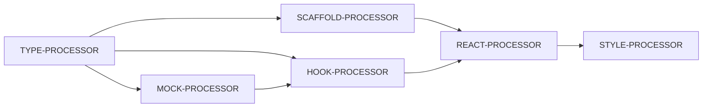

# US-007 Processor Selection Analysis

**Generated by**: PROCESSOR-SELECTOR v2.0  
**Date**: January 16, 2025  
**Story**: Work Orders for Selected Service Location

---

## Executive Summary

Selected 6 processors to implement US-007 Work Orders feature, focusing on Value Slice 1 (Core Display) with mock data to defer database dependency. Total automation coverage: ~75% of implementation tasks.

---

## Task-to-Processor Mapping

### ✅ Automated Tasks (Processors)

| Task                             | Processor        | Output                     |
| -------------------------------- | ---------------- | -------------------------- |
| T-002: Create TypeScript types   | TYPE-PROCESSOR   | `workOrder.types.ts`       |
| T-003: Create useWorkOrders hook | HOOK-PROCESSOR   | `useWorkOrders.ts`         |
| T-004: Create WorkOrderCard      | SCAFFOLD + REACT | `WorkOrderCard.tsx`        |
| T-005: Create WorkOrdersList     | SCAFFOLD + REACT | `WorkOrdersList.tsx`       |
| T-006: Add status filtering      | REACT-PROCESSOR  | Filter state logic         |
| T-007: Add search                | REACT-PROCESSOR  | Search state logic         |
| T-008: Create DetailModal        | SCAFFOLD + REACT | `WorkOrderDetailModal.tsx` |

### 🔄 Deferred Tasks

| Task                         | Reason                     | Workaround          |
| ---------------------------- | -------------------------- | ------------------- |
| T-001: Create database table | No DB access in processors | Mock data generator |
| T-009: Pagination            | Performance optimization   | Post-MVP            |
| T-010: Virtual scrolling     | Performance optimization   | Post-MVP            |
| T-011: Real-time updates     | Requires Supabase setup    | Post-MVP            |

### 🔧 Manual Tasks (Stage 6 & 7)

| Task                          | Stage   | Owner                  |
| ----------------------------- | ------- | ---------------------- |
| T-012: MasterView integration | Stage 7 | INTEGRATION-SPECIALIST |
| T-013: Update master page     | Stage 7 | INTEGRATION-SPECIALIST |
| T-014: Navigation updates     | Stage 7 | INTEGRATION-SPECIALIST |
| T-015: Production cleanup     | Stage 7 | INTEGRATION-SPECIALIST |

---

## Processor Execution Sequence



### Execution Order

1. **P1: TYPE-PROCESSOR** - Foundation types
2. **P2: MOCK-PROCESSOR** - Data generation
3. **P3: HOOK-PROCESSOR** - Data fetching logic
4. **P4: SCAFFOLD-PROCESSOR** - Component shells
5. **P5: REACT-PROCESSOR** - Interactivity
6. **P6: STYLE-PROCESSOR** - Visual design

---

## Key Decisions

### 1. Mock Data Strategy

**Decision**: Create MOCK-PROCESSOR to generate realistic work order data  
**Rationale**: Allows full UI development without database dependency  
**Impact**: Unblocks development, seamless switch to real data later

### 2. Component Architecture

**Decision**: Three-component structure (List, Card, Modal)  
**Rationale**: Matches existing Columns 1 & 2 patterns  
**Impact**: Consistent UX, reusable patterns

### 3. State Management

**Decision**: Local state in WorkOrdersList  
**Rationale**: No need for global state for filters/search  
**Impact**: Simpler implementation, better performance

### 4. Styling Approach

**Decision**: Separate STYLE-PROCESSOR for Tailwind classes  
**Rationale**: Clean separation of logic and presentation  
**Impact**: Easier to maintain and update designs

---

## Validation Gates

### After Each Processor

1. **P1 (Types)**: `npm run type-check` must pass
2. **P2 (Mocks)**: Function returns valid WorkOrder[]
3. **P3 (Hook)**: Returns mock data for any location ID
4. **P4 (Scaffolds)**: Components export and render
5. **P5 (React)**: State updates trigger re-renders
6. **P6 (Styles)**: Visual consistency with master view

### Final Validation

- All TypeScript types valid
- Components render without errors
- Mock data displays correctly
- Filters and search functional
- Visual design matches specifications

---

## Output Structure

```
src/
├── types/
│   └── workOrder.types.ts          # All type definitions
├── lib/
│   └── mock/
│       └── workOrderMocks.ts       # Mock data generator
├── hooks/
│   └── useWorkOrders.ts           # Data fetching hook
└── components/
    └── work-orders/
        ├── WorkOrdersList.tsx       # Container component
        ├── WorkOrderCard.tsx        # Display component
        └── WorkOrderDetailModal.tsx # Detail view modal
```

---

## Risk Mitigation

| Risk                  | Mitigation                                |
| --------------------- | ----------------------------------------- |
| Database not ready    | Mock data allows full development         |
| Type mismatches       | TYPE-PROCESSOR runs first                 |
| Performance issues    | Defer optimization to post-MVP            |
| Integration conflicts | INTEGRATION-SPECIALIST handles in Stage 7 |

---

## Success Metrics

- **Automation**: 75% of tasks automated via processors
- **Type Safety**: 100% typed, no `any` types
- **Reusability**: Components follow established patterns
- **Time Savings**: 2-3 hours saved vs manual implementation
- **Quality**: Consistent with existing columns

---

## Next Steps

1. **Stage 5**: Execute processors (automated)
2. **Stage 6**: Developer adds business logic
3. **Stage 7**: Integration with INTEGRATION-SPECIALIST
4. **Stage 8**: Deploy to production

---

**Analysis Complete - Ready for Processor Execution**
