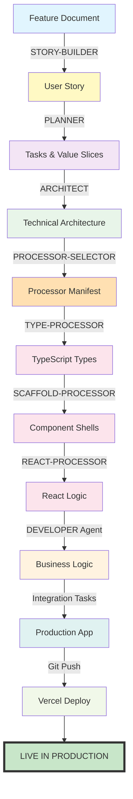

# SDLC Pipeline Definition - Feature to Production

**Version**: 1.0  
**Created**: August 14, 2025  
**Purpose**: Definitive pipeline for transforming features into production code

---

## 🎯 Pipeline Overview

Transform business features into working production code through a deterministic, automated pipeline where each stage has clear inputs, outputs, and triggers.

```
FEATURE → STORY → TASKS → ARCHITECTURE → PROCESSORS → DEVELOPER → INTEGRATION → PRODUCTION
```

---

## 📊 Complete Pipeline Stages

### STAGE 1: Business Definition

**Owner**: Product Owner / Business Analyst  
**Agent**: STORY-BUILDER v2.1  
**Input**: `01-planning/features/[feature-name].md`  
**Output**: `01-planning/user-stories/US-XXX-[name].md`  
**Trigger**: Feature document approved  
**Validation**: Story includes all v2.1 sections (business + technical)  
**Next**: STAGE 2

### STAGE 2: Task Decomposition

**Owner**: PLANNER Agent  
**Agent**: PLANNER v5.2  
**Input**: User story from Stage 1  
**Output**: `.cursor/artifacts/current/planning/US-XXX-tasks.md`  
**Creates**:

- Tasks (T-001, T-002, etc.)
- Value Slices (groups of 3-4 tasks)
- Integration requirements
  **Trigger**: User story approved  
  **Validation**: Tasks grouped in value slices, integration slice present for UI  
  **Next**: STAGE 3

### STAGE 3: Technical Architecture

**Owner**: ARCHITECT Agent  
**Agent**: ARCHITECT (current version)  
**Input**:

- User story from Stage 1
- Tasks from Stage 2 (specifically Value Slice 1)
  **Output**: `02-design/specs/US-XXX-architecture.md`  
  **Creates**:
- Component specifications
- Interface definitions
- State management design
- Data flow diagrams
  **Trigger**: Value Slice 1 marked "REQUIRES ARCHITECT"  
  **Validation**: No 'any' types, clear component hierarchy  
  **Next**: STAGE 4

### STAGE 4: Processor Selection

**Owner**: PROCESSOR-SELECTOR Agent  
**Agent**: PROCESSOR-SELECTOR v2.0  
**Input**:

- Architecture from Stage 3
- Tasks from Stage 2
  **Output**:
- Human-readable analysis (in chat)
- `.sdlc/05-backlog/A-accounts/master-view/processor-manifest.json`
  **Creates**:
- Ordered list of processors to run
- Input/output specifications for each
- Execution script
  **Trigger**: Architecture approved  
  **Validation**: All tasks mapped to processors, sequence correct  
  **Next**: STAGE 5

### STAGE 5: Automated Processing

**Owner**: Various Processors  
**Processors**: As specified in manifest

```yaml
Common Sequence: 1. TYPE-PROCESSOR → .types.ts files
  2. SCAFFOLD-PROCESSOR → .tsx component shells
  3. REACT-PROCESSOR → React logic added
  4. HOOK-PROCESSOR → Custom hooks (if needed)
  5. MODIFY-PROCESSOR → Integration changes
  6. TEST-PROCESSOR → Test files
```

**Input**: Architecture + processor manifest  
**Output**: Generated code artifacts  
**Trigger**: Processor manifest created  
**Validation**: Each processor's validation gate  
**Next**: STAGE 6

### STAGE 6: Business Logic Implementation

**Owner**: DEVELOPER Agent  
**Agent**: DEVELOPER (current version)  
**Executor**: CC assumes DEVELOPER role  
**Input**: All generated artifacts from Stage 5 (types, scaffolds, basic React)  
**Output**:

- Working components with complete business logic
- Data fetching implementations
- State management connections
- Error handling and edge cases
- API integrations
  **Creates**:
- Completed hooks with real data queries
- Business logic in event handlers
- Validation and error handling
- Loading and error states
  **Trigger**: All processors complete  
  **Validation**:
- `npm run type-check` passes
- `npm run dev` works
- Feature functional with real data
- All TODO comments resolved
  **Next**: STAGE 7

### STAGE 7: Production Integration

**Owner**: Claude Code (CC)  
**Tasks**: From Integration Value Slice

- Wire feature into main application
- Update navigation/routing
- Remove test artifacts
  **Input**: Working components from Stage 6  
  **Output**: Feature integrated in production location  
  **Trigger**: Components tested and working  
  **Validation**: Feature accessible at production route (not /test/)  
  **Next**: STAGE 8

### STAGE 8: Deployment

**Owner**: Vercel (Automated)  
**Process**: CI/CD Pipeline  
**Input**: Git push to main branch  
**Output**: Live production deployment  
**Trigger**: PR approved and merged  
**Validation**: Production smoke tests pass  
**Next**: END

---

## 🔄 Pipeline Flow Diagram



---

## 🛠️ Available Processors

### Currently Built

- `type-processor.md` - Generate TypeScript types
- `scaffold-processor.md` - Create component shells
- `react-processor.md` - Add React logic
- `react-test-processor.md` - Generate React tests
- `hook-processor.md` - Create custom hooks
- `modify-processor.md` - Modify existing files
- `processor-selector.md` - Select processors
- `invocation-generator.md` - Generate invocations

### Needed (Use Manual)

- API-PROCESSOR → "Manual API implementation by CC"
- COMPONENT-PROCESSOR → "Use SCAFFOLD + manual"
- INTEGRATION-PROCESSOR → "Manual integration by CC"

---

## 📋 Execution Checklist

For each user story:

### Pre-Pipeline

- [ ] Feature document exists in `01-planning/features/`
- [ ] Feature approved by Product Owner
- [ ] Ready to create user story

### Pipeline Execution

- [ ] **Stage 1**: Run STORY-BUILDER → User story created
- [ ] **Stage 2**: Run PLANNER → Tasks and value slices defined
- [ ] **Stage 3**: Run ARCHITECT → Architecture specified (if needed)
- [ ] **Stage 4**: Run PROCESSOR-SELECTOR → Manifest created
- [ ] **Stage 5**: Execute processors per manifest
- [ ] **Stage 6**: CC runs DEVELOPER agent → Business logic implemented
- [ ] **Stage 7**: CC integrates to production
- [ ] **Stage 8**: Deploy to Vercel

### Post-Pipeline

- [ ] Feature accessible in production (not test page)
- [ ] All acceptance criteria met
- [ ] Retrospective documented

---

## 🚦 Quality Gates

Each stage has pass/fail criteria:

1. **Story Quality Gate**: All v2.1 sections present
2. **Task Quality Gate**: Value slices defined, integration included
3. **Architecture Quality Gate**: No 'any' types, clear patterns
4. **Processor Quality Gate**: All tasks mapped
5. **Code Quality Gate**: TypeScript/ESLint pass
6. **Integration Quality Gate**: Accessible in production
7. **Deployment Quality Gate**: Smoke tests pass

---

## 🎯 Key Principles

1. **Deterministic**: Same input → Same output
2. **Traceable**: Every artifact tracks to business value
3. **Automated**: Minimize manual work
4. **Validated**: Quality gates at each stage
5. **Production-Focused**: Features must reach users

---

## 📊 Success Metrics

### Pipeline Performance

- **Story → Tasks**: <30 minutes
- **Tasks → Architecture**: <1 hour
- **Architecture → Code**: <2 hours
- **Code → Production**: <30 minutes
- **Total: Feature → Production**: <4 hours

### Quality Metrics

- **First-time success rate**: >80%
- **Rework required**: <20%
- **Production defects**: <5%
- **User acceptance**: >90%

---

## 🔧 Troubleshooting

### Common Issues

**Problem**: PROCESSOR-SELECTOR can't find tasks  
**Solution**: Ensure PLANNER ran first and created tasks.md

**Problem**: Processors reference 'any' types  
**Solution**: Run architecture through quality gates first

**Problem**: Feature works in test but not production  
**Solution**: Ensure integration value slice was completed

**Problem**: Pipeline stalls between stages  
**Solution**: Check quality gates, review error messages

---

## 📝 Next Steps for US-006

1. ✅ STORY-BUILDER v2.1 completed US-006 v3
2. ✅ PLANNER created tasks and value slices
3. ✅ ARCHITECT created Value Slice 1 architecture
4. → Run PROCESSOR-SELECTOR to create manifest
5. → Execute processors in sequence
6. → CC assumes DEVELOPER role for business logic
7. → CC integrates to production
8. → Deploy to Vercel

---

## 🚀 Future Enhancements

1. **Automation Script**: Chain all stages automatically
2. **Progress Dashboard**: Visual pipeline status
3. **Parallel Processing**: Run independent tasks simultaneously
4. **Pattern Library**: Reuse common patterns
5. **AI Orchestrator**: Intelligent stage coordination

---

_This pipeline definition is the single source of truth for our software factory process._
