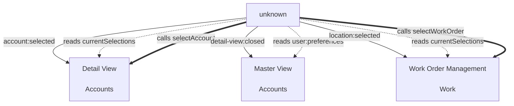

# 📡 Sub-Module Contract Registry

**Generated**: 2025-08-18T11:20:06.371Z  
**Total Sub-Modules**: 3  
**Total Events**: 3  
**Total Shared States**: 3  
**Total Public Methods**: 2

---

## 🏗️ Sub-Modules

### Accounts / Detail View
  (1.1.2)
- **ID**: `accounts/detail-view`
- **Hierarchy**: `1.1.2`
- **Path**: `C:\Users\GarryFenimore\Projects\service-software-factory-v2\.pipeline\concept\modules\accounts\detail-view\interface.ts`

#### Provides:
**Events:**
- `detail-view:opened` - Detail view modal/page opened

**State:**
- `isOpen` - Whether detail view is currently open

**Methods:**
- `selectAccount()` - Tell Master View to select different account

#### Consumes:
**Events:**
- `account:selected` from `unknown`

**State:**
- `currentSelections` from `unknown`

---

### Accounts / Master View
  (1.1.1)
- **ID**: `accounts/master-view`
- **Hierarchy**: `1.1.1`
- **Path**: `C:\Users\GarryFenimore\Projects\service-software-factory-v2\.pipeline\concept\modules\accounts\master-view\interface.ts`

#### Provides:
**Events:**
- `account:selected` - Fired when user selects an account

**State:**
- `currentSelections` - Currently selected items in all three columns

**Methods:**
- `selectAccount()` - Programmatically select an account

#### Consumes:
**Events:**
- `detail-view:closed` from `unknown`

**State:**
- `user:preferences` from `unknown`

---

### Work / Work Order Management
  (1.2.1)
- **ID**: `work-orders/management`
- **Hierarchy**: `1.2.1`
- **Path**: `C:\Users\GarryFenimore\Projects\service-software-factory-v2\.pipeline\concept\modules\work-orders\management\interface.ts`

#### Provides:
**Events:**
- `workOrder:created` - New work order created

**State:**
- `activeWorkOrders` - Currently active work orders

**Methods:**
- `createWorkOrder()` - Create new work order for a location

#### Consumes:
**Events:**
- `location:selected` from `unknown`

**State:**
- `currentSelections` from `unknown`

---

## 📤 Global Event Catalog

| Event | Providers | Description |
|-------|-----------|-------------|
| `detail-view:opened` | `accounts/detail-view` | Detail view modal/page opened |
| `account:selected` | `accounts/master-view` | Fired when user selects an account |
| `workOrder:created` | `work-orders/management` | New work order created |

## 🗃️ Global State Catalog

| State | Providers | Description |
|-------|-----------|-------------|
| `isOpen` | `accounts/detail-view` | Whether detail view is currently open |
| `currentSelections` | `accounts/master-view` | Currently selected items in all three columns |
| `activeWorkOrders` | `work-orders/management` | Currently active work orders |

## 🔧 Global Method Catalog

| Method | Providers | Description |
|--------|-----------|-------------|
| `selectAccount()` | `accounts/detail-view`, `accounts/master-view` | Tell Master View to select different account |
| `createWorkOrder()` | `work-orders/management` | Create new work order for a location |

## 🗺️ System Communication Map

## 🔄 Integration Flows

### Master View → Detail View Flow
1. User clicks account in Master View
2. Master View emits `account:selected` event
3. Detail View receives event and opens
4. Detail View emits `detail-view:opened`
5. User edits and saves
6. Detail View emits `account:updated`
7. Master View receives and refreshes
8. Detail View emits `detail-view:closed`

### Master View → Work Order Management Flow  
1. User selects location in Master View
2. Master View emits `location:selected` event
3. Work Order Management receives and filters orders
4. User creates new work order
5. Work Order Management emits `workOrder:created`
6. Master View receives and updates count
