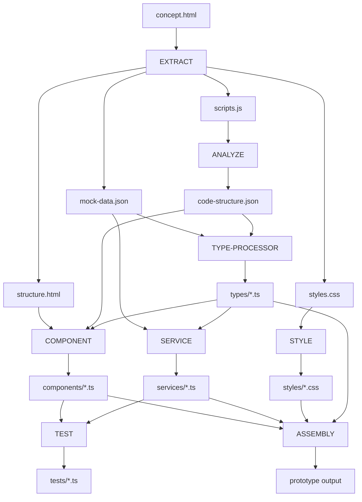

# Processor Analysis: Concept → Prototype Transformation

## 📊 Current State Analysis

### What We Have (Concept)
- **File**: `1.1.1-master-view-CONCEPT.html`
- **Structure**: Single HTML file with inline everything
- **Content**:
  - HTML structure (three columns)
  - Inline CSS styles
  - Inline JavaScript (700+ lines)
  - Mock data embedded
  - Event handlers inline
  - Global variables

### What We Need (Prototype)
Based on `factory-standards.yaml`:
- TypeScript with strict mode
- Component architecture
- Separated concerns (HTML, CSS, JS)
- 60% test coverage
- No `any` types
- Error handling
- Loading states

## 🔧 Required Processors & Order

### Phase 1: Extraction (Pull apart the monolith)

#### 1. **EXTRACT-PROCESSOR** (New)
**Input**: `1.1.1-master-view-CONCEPT.html`  
**Outputs**:
- `extracted/structure.html` - Just the HTML structure
- `extracted/styles.css` - Extracted inline styles
- `extracted/scripts.js` - Extracted JavaScript
- `extracted/mock-data.json` - Extracted mock data

#### 2. **ANALYZE-PROCESSOR** (New)
**Input**: `extracted/scripts.js`  
**Output**: `analysis/code-structure.json`
- Identifies functions
- Maps event handlers
- Finds state variables
- Traces data flow
- Identifies UI updates

### Phase 2: Type Generation

#### 3. **TYPE-PROCESSOR** (Existing, needs line-awareness)
**Input**: `extracted/mock-data.json` + `analysis/code-structure.json`  
**Outputs**:
- `types/entities.ts` - Account, Location, WorkOrder interfaces
- `types/state.ts` - State management types
- `types/events.ts` - Event payload types

### Phase 3: Componentization

#### 4. **COMPONENT-PROCESSOR** (New)
**Input**: `extracted/structure.html` + `analysis/code-structure.json`  
**Outputs**:
- `components/MasterView.ts` - Main container
- `components/AccountColumn.ts`
- `components/LocationColumn.ts`
- `components/WorkOrderColumn.ts`
- `components/SearchBox.ts`
- `components/Card.ts`

### Phase 4: Service Layer

#### 5. **SERVICE-PROCESSOR** (New)
**Input**: `extracted/mock-data.json` + `types/entities.ts`  
**Outputs**:
- `services/DataService.ts` - Data fetching with types
- `services/EventBus.ts` - Typed event system
- `services/StateManager.ts` - State management

### Phase 5: Styling

#### 6. **STYLE-PROCESSOR** (New/Modified SCAFFOLD-PROCESSOR)
**Input**: `extracted/styles.css`  
**Outputs**:
- `styles/master-view.module.css`
- `styles/column.module.css`
- `styles/card.module.css`
- `styles/search.module.css`

### Phase 6: Testing

#### 7. **TEST-PROCESSOR** (Existing)
**Input**: All components + services  
**Outputs**:
- `tests/components/*.test.ts`
- `tests/services/*.test.ts`
- `tests/integration/*.test.ts`

### Phase 7: Assembly

#### 8. **ASSEMBLY-PROCESSOR** (New)
**Input**: All above outputs  
**Outputs**:
- `dist/index.html`
- `dist/main.ts`
- `dist/styles.css`
- `package.json` configured
- `tsconfig.json` configured

## 📋 Processor Requirements

### Must Create/Adapt:
1. **EXTRACT-PROCESSOR** - Break apart HTML file
2. **ANALYZE-PROCESSOR** - Understand code structure  
3. **COMPONENT-PROCESSOR** - Generate components
4. **SERVICE-PROCESSOR** - Create service layer
5. **ASSEMBLY-PROCESSOR** - Put it back together

### Must Make Line-Aware:
1. **TYPE-PROCESSOR** - Already configured, needs implementation
2. **TEST-PROCESSOR** - Different coverage per line
3. **STYLE-PROCESSOR** - Inline → modules → optimized

## 🔄 Execution Flow

## 🎯 Minimum Viable Processor Set

For our first run, we could start with just:

1. **EXTRACT-PROCESSOR** - Essential to break apart the HTML
2. **TYPE-PROCESSOR** - Critical for prototype requirements
3. **COMPONENT-PROCESSOR** - Core transformation
4. **ASSEMBLY-PROCESSOR** - Put it back together

This would give us a working prototype, then we can add:
- SERVICE-PROCESSOR for better architecture
- TEST-PROCESSOR for coverage
- STYLE-PROCESSOR for better CSS

## 📊 Line-Aware Behavior

Each processor should adapt based on target line:

### Concept Mode
- Allow any types
- Inline everything is OK
- No tests required
- Console.log allowed

### Prototype Mode
- Strict types required
- Components required
- 60% test coverage
- Basic error handling

### Production Mode
- Runtime validation
- Full error boundaries
- 80% test coverage
- Performance optimization
- Security hardening

## 🚀 Next Steps

1. Build **EXTRACT-PROCESSOR** first (most critical)
2. Adapt **TYPE-PROCESSOR** to be line-aware
3. Build **COMPONENT-PROCESSOR**
4. Build **ASSEMBLY-PROCESSOR**
5. Test the pipeline end-to-end
6. Add remaining processors incrementally