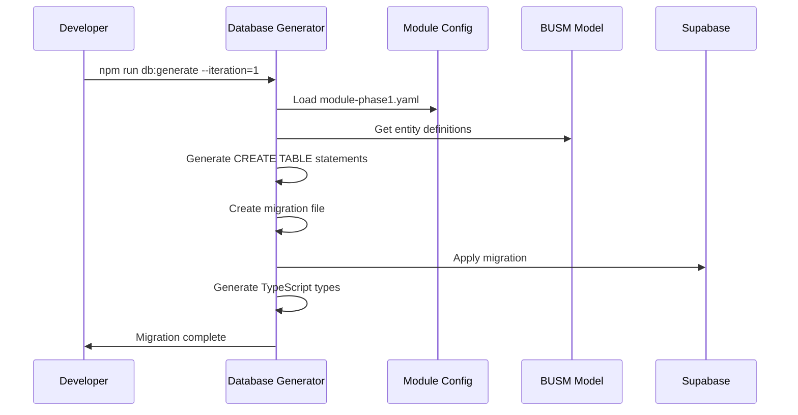
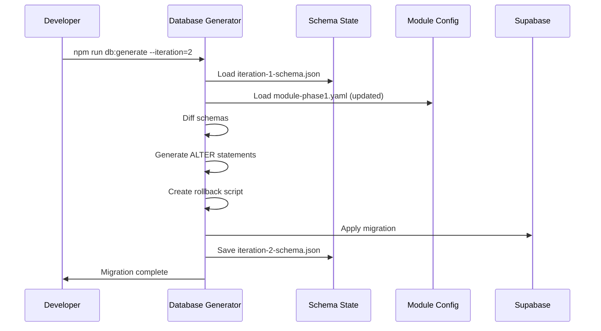

# Database Generator PRD
*Product Requirements Document for the Prototype Line Database Generator*

## Executive Summary

The Database Generator is a critical component of the Service Software Factory that creates and manages database schemas through the three-stage lifecycle: Concept → Prototype → Production. This PRD focuses on the **Prototype mode** implementation, which generates real, working Supabase tables iteratively as sub-modules are developed.

## Problem Statement

Currently, developers manually create database tables for each prototype iteration, leading to:
- Inconsistent schema definitions across iterations
- Manual migration writing for each change
- Difficulty tracking schema evolution
- No automated connection between module definitions and database structure
- Risk of schema drift between iterations

## Solution Overview

The Database Generator for Prototype mode will:
1. **Automatically generate Supabase tables** from module definitions
2. **Handle iterative schema evolution** as sub-modules develop
3. **Track all schema changes** across iterations
4. **Generate rollback scripts** for each iteration
5. **Maintain schema-module alignment** automatically

## Key Features

### 1. Iterative Schema Generation
- Generate initial tables for iteration 1
- Create ALTER statements for subsequent iterations
- Track schema state per iteration
- Support both additive and modification changes

### 2. Minimal Viable Schema
- Only create fields currently needed
- Basic foreign key relationships only
- No complex constraints in prototype
- Focus on "make it work" not "make it perfect"

### 3. Supabase Integration
- Generate Supabase-compatible SQL
- Create migration files for Supabase CLI
- Support Supabase-specific features (UUID, auth schema)
- Generate TypeScript types from schema

### 4. Change Tracking
- Record all schema modifications
- Generate rollback scripts automatically
- Maintain iteration history
- Support branching for experiments

## Technical Architecture

### Input Sources

```yaml
Primary Input: Module Definition
Location: .pipeline/modules/{module-name}-phase{n}.yaml
Contains:
  - entities: List of entities needed
  - fields: Specific fields required
  - relationships: How entities connect
  - iteration: Current iteration number

Secondary Input: BUSM Model
Location: .pipeline/factory-tools/busm-reader/busm-model.json
Contains:
  - Complete entity definitions
  - Field types and constraints
  - Business relationships
```

### Output Artifacts

```yaml
Migration Files:
Location: .pipeline/database/migrations/prototype/
Format: {timestamp}_{iteration}_{description}.sql
Example: 20250823_iter1_create_account_table.sql

Schema State:
Location: .pipeline/database/state/prototype/
Format: iteration-{n}-schema.json
Contains: Complete schema snapshot after iteration

Rollback Scripts:
Location: .pipeline/database/rollbacks/prototype/
Format: rollback-iteration-{n}.sql
Purpose: Undo changes if needed

TypeScript Types:
Location: .pipeline/database/types/
Format: database-types-iter{n}.ts
Generated: After each iteration
```

## Core Workflows

### Workflow 1: Initial Table Creation (Iteration 1)



### Workflow 2: Incremental Changes (Iteration 2+)



## Implementation Details

### Database Generator Class Structure

```javascript
class PrototypeDatabaseGenerator {
  constructor(config) {
    this.supabaseUrl = config.supabaseUrl;
    this.projectId = config.projectId;
    this.currentIteration = config.iteration;
    this.moduleConfig = null;
    this.busmModel = null;
    this.previousSchema = null;
  }

  async generate() {
    // 1. Load inputs
    await this.loadModuleConfig();
    await this.loadBUSMModel();
    await this.loadPreviousSchema();
    
    // 2. Generate schema
    const newSchema = this.buildSchema();
    
    // 3. Create migrations
    const migrations = this.generateMigrations(newSchema);
    
    // 4. Apply to database
    await this.applyMigrations(migrations);
    
    // 5. Generate artifacts
    await this.generateTypeScript(newSchema);
    await this.saveSchemaState(newSchema);
    await this.generateRollback(migrations);
    
    return {
      success: true,
      tablesCreated: migrations.creates.length,
      tablesModified: migrations.alters.length,
      iteration: this.currentIteration
    };
  }

  buildSchema() {
    const schema = {};
    
    // For each entity in module config
    this.moduleConfig.entities.forEach(entityName => {
      // Get definition from BUSM
      const busmEntity = this.busmModel.entities[entityName];
      
      // Only include fields specified in module
      const fields = this.moduleConfig.fields[entityName] || [];
      
      schema[entityName] = {
        name: entityName,
        fields: this.selectFields(busmEntity, fields),
        relationships: this.buildRelationships(entityName)
      };
    });
    
    return schema;
  }

  generateMigrations(newSchema) {
    const migrations = {
      creates: [],
      alters: [],
      drops: []
    };
    
    if (this.currentIteration === 1) {
      // First iteration - all CREATE statements
      Object.values(newSchema).forEach(table => {
        migrations.creates.push(this.generateCreateTable(table));
      });
    } else {
      // Subsequent iterations - diff and generate changes
      const diff = this.diffSchemas(this.previousSchema, newSchema);
      
      diff.newTables.forEach(table => {
        migrations.creates.push(this.generateCreateTable(table));
      });
      
      diff.modifiedTables.forEach(change => {
        migrations.alters.push(this.generateAlterTable(change));
      });
    }
    
    return migrations;
  }
}
```

### SQL Generation Examples

#### Iteration 1: Basic Account Table
```sql
-- Migration: 20250823_iter1_create_account_table.sql
CREATE TABLE accounts (
  id UUID DEFAULT gen_random_uuid() PRIMARY KEY,
  name VARCHAR(255) NOT NULL,
  type VARCHAR(50),
  status VARCHAR(50) DEFAULT 'Active'
);

-- Basic index for searching
CREATE INDEX idx_accounts_name ON accounts(name);
```

#### Iteration 2: Add Location Support
```sql
-- Migration: 20250823_iter2_add_locations.sql
-- Add location reference to accounts
ALTER TABLE accounts 
  ADD COLUMN primary_location_id UUID;

-- Create locations table
CREATE TABLE locations (
  id UUID DEFAULT gen_random_uuid() PRIMARY KEY,
  account_id UUID REFERENCES accounts(id),
  address TEXT,
  city VARCHAR(100),
  state VARCHAR(2),
  zip VARCHAR(10)
);

-- Add foreign key after table creation
ALTER TABLE accounts
  ADD CONSTRAINT fk_primary_location 
  FOREIGN KEY (primary_location_id) 
  REFERENCES locations(id);

-- Index for account lookups
CREATE INDEX idx_locations_account ON locations(account_id);
```

#### Iteration 3: Add Contact Information
```sql
-- Migration: 20250823_iter3_add_contact_fields.sql
ALTER TABLE accounts
  ADD COLUMN email VARCHAR(255),
  ADD COLUMN phone VARCHAR(20),
  ADD COLUMN website VARCHAR(255);

-- Add uniqueness for email (optional in prototype)
CREATE UNIQUE INDEX idx_accounts_email ON accounts(email) 
  WHERE email IS NOT NULL;
```

### TypeScript Generation

```typescript
// Generated: database-types-iter3.ts
export interface Database {
  public: {
    Tables: {
      accounts: {
        Row: {
          id: string
          name: string
          type: string | null
          status: string
          primary_location_id: string | null
          email: string | null
          phone: string | null
          website: string | null
        }
        Insert: {
          id?: string
          name: string
          type?: string | null
          status?: string
          primary_location_id?: string | null
          email?: string | null
          phone?: string | null
          website?: string | null
        }
        Update: {
          id?: string
          name?: string
          type?: string | null
          status?: string
          primary_location_id?: string | null
          email?: string | null
          phone?: string | null
          website?: string | null
        }
      }
      locations: {
        Row: {
          id: string
          account_id: string | null
          address: string | null
          city: string | null
          state: string | null
          zip: string | null
        }
        // ... Insert and Update types
      }
    }
  }
}
```

## User Interface (CLI)

### Primary Commands

```bash
# Generate database for current iteration
npm run db:generate

# Generate with specific iteration
npm run db:generate --iteration=2

# Preview changes without applying
npm run db:preview

# Rollback to previous iteration
npm run db:rollback

# Show current schema state
npm run db:status

# Generate TypeScript types only
npm run db:types
```

### Interactive Mode

```bash
$ npm run db:generate

🏭 Database Generator - Prototype Mode
━━━━━━━━━━━━━━━━━━━━━━━━━━━━━━━━━━━
Module: account-management
Phase: 1
Iteration: 2 (previous: 1)

📊 Schema Analysis:
  ✓ Loaded previous schema (2 tables)
  ✓ Loaded module config
  ✓ Analyzed changes

📝 Planned Changes:
  CREATE TABLE: contacts (5 fields)
  ALTER TABLE: accounts (ADD 3 fields)
  
  Total operations: 2 creates, 1 alter

⚠️  This will modify your Supabase database

Proceed? (y/N): y

🔨 Applying migrations...
  ✓ Created table: contacts
  ✓ Altered table: accounts
  ✓ Generated TypeScript types
  ✓ Saved schema state
  ✓ Created rollback script

✅ Database updated successfully!

Next steps:
  - Test with: npm run test:db
  - View types: .pipeline/database/types/database-types-iter2.ts
  - Rollback if needed: npm run db:rollback
```

## Configuration

### database-generator.config.js
```javascript
module.exports = {
  // Prototype line configuration
  prototype: {
    // Supabase connection
    supabaseUrl: process.env.SUPABASE_URL,
    supabaseAnonKey: process.env.SUPABASE_ANON_KEY,
    projectId: process.env.SUPABASE_PROJECT_ID,
    
    // File locations
    paths: {
      modules: '.pipeline/modules/',
      busm: '.pipeline/factory-tools/busm-reader/busm-model.json',
      migrations: '.pipeline/database/migrations/prototype/',
      state: '.pipeline/database/state/prototype/',
      rollbacks: '.pipeline/database/rollbacks/prototype/',
      types: '.pipeline/database/types/'
    },
    
    // Generation rules
    rules: {
      // Prototype is minimal
      includeConstraints: false,
      includeIndexes: 'basic',  // Only primary keys and foreign keys
      includeRLS: false,
      includeAudit: false,
      includeSoftDelete: false,
      
      // Field defaults
      useUUIDs: true,
      defaultStringLength: 255,
      
      // Naming conventions
      tableNamePattern: 'snake_case',
      columnNamePattern: 'snake_case',
      indexNamePattern: 'idx_{table}_{column}',
      constraintNamePattern: 'fk_{table}_{column}'
    },
    
    // Iteration tracking
    iteration: {
      current: 1,  // Set by CLI or auto-detected
      allowRollback: true,
      keepHistory: true,
      maxHistoryCount: 10
    }
  }
};
```

## Success Metrics

### Quantitative Metrics
- **Migration Success Rate**: >99% of generated migrations apply successfully
- **Generation Speed**: <2 seconds for typical module
- **Type Accuracy**: 100% TypeScript type correctness
- **Rollback Success**: 100% successful rollbacks when needed

### Qualitative Metrics
- **Developer Satisfaction**: Eliminates manual migration writing
- **Iteration Velocity**: 10x faster schema changes
- **Error Reduction**: 90% fewer schema-related bugs
- **Traceability**: Complete history of all changes

## Edge Cases and Error Handling

### Common Scenarios

1. **Conflicting Field Types**
   - Scenario: Module requests VARCHAR, BUSM says INTEGER
   - Solution: Use module type in prototype, log warning
   
2. **Missing BUSM Entity**
   - Scenario: Module references entity not in BUSM
   - Solution: Generate minimal table, flag for BUSM update

3. **Circular References**
   - Scenario: A references B, B references A
   - Solution: Create tables first, add constraints after

4. **Rollback with Data**
   - Scenario: Need to rollback but table has data
   - Solution: Generate data preservation script

### Error Messages

```javascript
const errors = {
  MISSING_ENTITY: "Entity '{entity}' not found in BUSM model",
  TYPE_MISMATCH: "Field '{field}' type mismatch: module says {moduleType}, BUSM says {busmType}",
  MIGRATION_FAILED: "Migration failed: {error}. Rollback script available at {path}",
  CONNECTION_ERROR: "Cannot connect to Supabase. Check credentials.",
  INVALID_ITERATION: "Iteration {n} cannot be applied. Current state is iteration {current}"
};
```

## Dependencies

### Required Components
- **BUSM Reader**: Source of entity definitions
- **Module System**: Module configurations
- **Supabase CLI**: Database operations
- **TypeScript Compiler**: Type generation

### npm Packages
```json
{
  "dependencies": {
    "@supabase/supabase-js": "^2.x",
    "pg-format": "^1.x",  // SQL formatting
    "json-diff": "^1.x",  // Schema comparison
    "prettier": "^3.x"    // Code formatting
  }
}
```

## Testing Strategy

### Unit Tests
- SQL generation correctness
- Schema diffing algorithm
- TypeScript type generation
- Rollback script generation

### Integration Tests
- Full iteration workflow
- Actual Supabase operations
- Multi-iteration sequences
- Rollback operations

### Test Database
- Separate Supabase project for testing
- Automated cleanup after tests
- Parallel test execution support

## Future Enhancements (Not in MVP)

1. **Visual Schema Designer**
   - Drag-and-drop table creation
   - Visual relationship builder
   
2. **AI-Powered Suggestions**
   - Recommend indexes based on queries
   - Suggest field types from names

3. **Data Migration Support**
   - Transform data between iterations
   - Seed data management

4. **Multi-Environment Support**
   - Dev/staging/prod pipelines
   - Environment-specific configurations

## Implementation Timeline

### Phase 1: Core Generator (Week 1)
- [ ] Basic schema generation
- [ ] CREATE TABLE generation
- [ ] Initial Supabase integration
- [ ] Simple TypeScript types

### Phase 2: Iteration Support (Week 2)
- [ ] Schema state tracking
- [ ] ALTER TABLE generation
- [ ] Rollback scripts
- [ ] Diff algorithm

### Phase 3: Polish & Testing (Week 3)
- [ ] CLI interface
- [ ] Error handling
- [ ] Comprehensive tests
- [ ] Documentation

## Risks and Mitigations

| Risk | Impact | Mitigation |
|------|--------|------------|
| Complex schema conflicts | High | Clear conflict resolution rules |
| Supabase API changes | Medium | Version lock, abstraction layer |
| Data loss during rollback | High | Always create backups, warn user |
| Performance with large schemas | Low | Optimize diff algorithm, caching |

## Success Criteria

The Database Generator for Prototype mode will be considered successful when:

1. ✅ Generates working Supabase tables from module configs
2. ✅ Handles iterations without manual SQL
3. ✅ Produces accurate TypeScript types
4. ✅ Supports rollback for all operations
5. ✅ Integrates seamlessly with existing pipeline
6. ✅ Reduces database setup time by 90%

## Appendix A: Example Module Configuration

```yaml
# account-management-phase1.yaml
module: account-management
phase: 1
iteration: 2
entities:
  - Account
  - Location
  - Contact
fields:
  Account:
    - id
    - name
    - type
    - status
    - email
    - phone
  Location:
    - id
    - account_id
    - address
    - city
    - state
    - zip
  Contact:
    - id
    - account_id
    - first_name
    - last_name
    - email
    - phone
relationships:
  - from: Location
    to: Account
    type: many-to-one
    field: account_id
  - from: Contact
    to: Account
    type: many-to-one
    field: account_id
```

## Appendix B: Sample Generated Migration

```sql
-- 20250823_iter2_add_contacts_and_fields.sql
-- Generated by Database Generator v1.0
-- Module: account-management
-- Iteration: 2

-- Add new fields to existing accounts table
ALTER TABLE accounts
  ADD COLUMN email VARCHAR(255),
  ADD COLUMN phone VARCHAR(20);

-- Create new contacts table
CREATE TABLE contacts (
  id UUID DEFAULT gen_random_uuid() PRIMARY KEY,
  account_id UUID REFERENCES accounts(id),
  first_name VARCHAR(255),
  last_name VARCHAR(255),
  email VARCHAR(255),
  phone VARCHAR(20)
);

-- Add basic indexes for foreign keys
CREATE INDEX idx_contacts_account_id ON contacts(account_id);

-- Migration metadata
COMMENT ON TABLE contacts IS 'Created in iteration 2 for account-management module';
```

---

*Database Generator PRD v1.0*
*Prototype Mode Focus*
*Part of the Service Software Factory Pipeline*