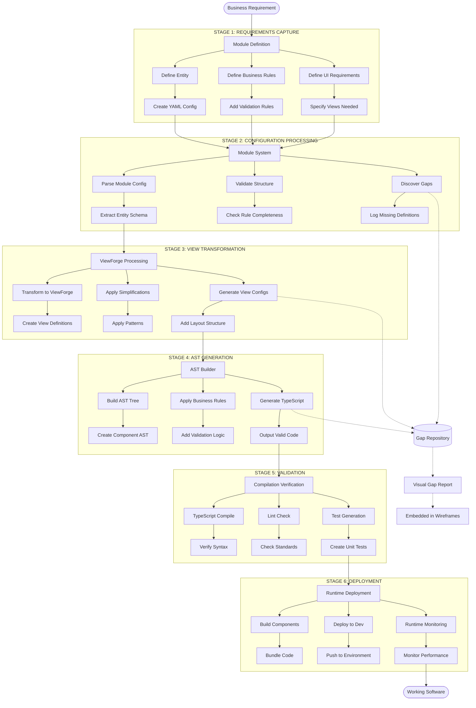

# Concept Line Flow Diagram
*The Complete Production Pipeline from Idea to Deployed Component*

## Overview
The Concept Line is our automated production pipeline that transforms business concepts into deployed, working software components with automatic gap discovery throughout.

```
═══════════════════════════════════════════════════════════════════════════════
                        THE CONCEPT LINE PRODUCTION FLOW
═══════════════════════════════════════════════════════════════════════════════

 [Business Need] → [Module Config] → [ViewForge] → [AST] → [Component] → [Deploy]
                        ↓                ↓           ↓          ↓           ↓
                    [Gap Discovery] [Gap Discovery] [Gaps] [Validation] [Runtime]
═══════════════════════════════════════════════════════════════════════════════
```

## Detailed Flow Diagram



## Stage Details

### STAGE 1: REQUIREMENTS CAPTURE
**Purpose**: Transform business needs into structured configuration

| Component | Details |
|-----------|---------|
| **Process** | Module Definition |
| **Activities** | • Define Entity<br>• Define Business Rules<br>• Define UI Requirements |
| **Tasks** | • Create YAML Config<br>• Add Validation Rules<br>• Specify Views Needed |
| **Tools** | • Module System YAML Editor<br>• Business Rules Configurator (`rules-cli.js`) |
| **Inputs** | • Business requirements<br>• Domain knowledge<br>• User stories |
| **Outputs** | • `phase1-account-basic.yaml`<br>• Business rules YAML<br>• UI specifications |
| **Gap Discovery** | • Missing field definitions<br>• Undefined business rules<br>• Incomplete validation |

### STAGE 2: CONFIGURATION PROCESSING
**Purpose**: Parse and validate module configuration with gap discovery

| Component | Details |
|-----------|---------|
| **Process** | Module System Processing |
| **Activities** | • Parse Module Config<br>• Validate Structure<br>• Discover Gaps |
| **Tasks** | • Extract Entity Schema<br>• Check Rule Completeness<br>• Log Missing Definitions |
| **Tools** | • Module Parser<br>• Business Rules Parser (`business-rules-parser.js`)<br>• Gap Logger |
| **Inputs** | • Module YAML files<br>• Business rules YAML |
| **Outputs** | • Parsed configuration object<br>• Entity schemas<br>• Gap discovery report |
| **Gap Discovery** | • Missing required fields<br>• Undefined rule references<br>• Incomplete configurations |

### STAGE 3: VIEW TRANSFORMATION
**Purpose**: Transform module config into ViewForge view definitions

| Component | Details |
|-----------|---------|
| **Process** | ViewForge Transformation |
| **Activities** | • Transform to ViewForge<br>• Apply Simplifications<br>• Generate View Configs |
| **Tasks** | • Create View Definitions<br>• Apply Patterns<br>• Add Layout Structure |
| **Tools** | • ViewForge Transformer (`viewforge-transformer.js`)<br>• Pattern Library |
| **Inputs** | • Parsed module config<br>• UI specifications<br>• Layout preferences |
| **Outputs** | • ViewForge configuration<br>• View component specs<br>• Layout definitions |
| **Gap Discovery** | • Missing view types<br>• Undefined layouts<br>• Missing component specs |

### STAGE 4: AST GENERATION
**Purpose**: Generate guaranteed valid TypeScript/React components

| Component | Details |
|-----------|---------|
| **Process** | AST-Based Code Generation |
| **Activities** | • Build AST Tree<br>• Apply Business Rules<br>• Generate TypeScript |
| **Tasks** | • Create Component AST<br>• Add Validation Logic<br>• Output Valid Code |
| **Tools** | • AST Builder (`ast-builder-simple.js`)<br>• Component Builder<br>• Pattern Factory |
| **Inputs** | • ViewForge config<br>• Business rules<br>• Type definitions |
| **Outputs** | • TypeScript components<br>• Type interfaces<br>• Validation functions |
| **Gap Discovery** | • Missing types<br>• Undefined handlers<br>• Missing implementations |

### STAGE 5: VALIDATION
**Purpose**: Verify generated code compiles and meets standards

| Component | Details |
|-----------|---------|
| **Process** | Compilation & Quality Verification |
| **Activities** | • TypeScript Compile<br>• Lint Check<br>• Test Generation |
| **Tasks** | • Verify Syntax<br>• Check Standards<br>• Create Unit Tests |
| **Tools** | • TypeScript Compiler<br>• ESLint<br>• Test Generator |
| **Inputs** | • Generated TypeScript code<br>• Coding standards<br>• Test templates |
| **Outputs** | • Compiled JavaScript<br>• Lint report<br>• Unit test files |
| **Gap Discovery** | • Type errors<br>• Lint violations<br>• Missing test coverage |

### STAGE 6: DEPLOYMENT
**Purpose**: Deploy components to runtime environment

| Component | Details |
|-----------|---------|
| **Process** | Runtime Deployment |
| **Activities** | • Build Components<br>• Deploy to Dev<br>• Runtime Monitoring |
| **Tasks** | • Bundle Code<br>• Push to Environment<br>• Monitor Performance |
| **Tools** | • Build System (Webpack/Vite)<br>• Deployment Pipeline<br>• Monitoring Tools |
| **Inputs** | • Validated components<br>• Environment config<br>• Deployment specs |
| **Outputs** | • Deployed application<br>• Performance metrics<br>• Runtime logs |
| **Gap Discovery** | • Runtime errors<br>• Performance issues<br>• Missing dependencies |

## Data Flow Through the Pipeline

```
┌─────────────────────────────────────────────────────────────────────────┐
│                          DATA TRANSFORMATION FLOW                        │
└─────────────────────────────────────────────────────────────────────────┘

1. Business Requirements (Human Language)
   ↓
2. Module Configuration (YAML)
   Example: phase1-account-basic.yaml
   ```yaml
   entity:
     name: Account
     fields:
       - name: name
         type: text
   ```
   ↓
3. ViewForge Configuration (Simplified Structure)
   ```javascript
   {
     entity: { name: 'Account', fields: [...] },
     views: [{ type: 'list', name: 'AccountList' }]
   }
   ```
   ↓
4. AST Tree (In-Memory Structure)
   ```
   ComponentNode {
     type: 'FunctionalComponent',
     name: 'AccountList',
     props: [...],
     body: [...]
   }
   ```
   ↓
5. TypeScript Code (Valid Syntax)
   ```typescript
   export const AccountList = (props: AccountListProps) => {
     const [filter, setFilter] = useState('');
     return <div>...</div>;
   }
   ```
   ↓
6. Compiled JavaScript (Runtime Ready)
   ↓
7. Deployed Component (User Facing)
```

## Gap Discovery Integration

### Gap Discovery Points
Every stage discovers and reports gaps:

```
Stage 1: Requirements Gaps
  └── "Account type 'Government' mentioned but not defined"

Stage 2: Configuration Gaps  
  └── "Field 'taxId' referenced but not in entity definition"

Stage 3: View Gaps
  └── "ListView requested but no list layout defined"

Stage 4: AST Gaps
  └── "Handler 'onDelete' has no implementation"

Stage 5: Validation Gaps
  └── "Type 'Service' imported but not defined"

Stage 6: Runtime Gaps
  └── "API endpoint '/accounts' returns 404"
```

### Gap Aggregation
All gaps flow to central repository:

```javascript
{
  "timestamp": "2025-08-23T12:30:00Z",
  "pipeline": "concept-line",
  "module": "account-phase1",
  "gaps": [
    {
      "stage": 1,
      "severity": "HIGH",
      "category": "MISSING_DEFINITION",
      "message": "Account status 'Archived' not in enum"
    }
  ]
}
```

## Tools and Their Roles

### Core Tools
1. **Module System** - Configuration management
2. **Business Rules Configurator** - Rules definition and validation
3. **ViewForge Transformer** - View simplification
4. **AST Generator** - Code generation with guaranteed syntax
5. **Gap Logger** - Centralized gap discovery and reporting
6. **Concept Generator** - Wireframe creation with embedded gaps

### Supporting Tools
1. **YAML Parser** - Configuration parsing
2. **TypeScript Compiler** - Syntax validation
3. **Pattern Factory** - Common component patterns
4. **Visual Gap Logger** - Wireframe gap embedding

## Success Metrics

### Per-Stage Metrics
- **Stage 1**: Configuration completeness (%)
- **Stage 2**: Validation pass rate (%)
- **Stage 3**: View coverage (%)
- **Stage 4**: AST generation success (%)
- **Stage 5**: Compilation success (%)
- **Stage 6**: Deployment success (%)

### Overall Pipeline Metrics
- **End-to-End Time**: < 30 seconds
- **Gap Discovery Rate**: 100% of definable gaps
- **Code Quality**: 0 syntax errors, 0 type errors
- **First-Time Success Rate**: > 95% with complete config

## Automation Level

### Current State
- **Stages 1-4**: Fully automated
- **Stage 5**: Semi-automated (manual review optional)
- **Stage 6**: Manual trigger (automated process)

### Target State
- **All Stages**: Fully automated with CI/CD integration
- **Gap Resolution**: AI-assisted recommendations
- **Deployment**: Automatic with rollback capability

## Next Evolution

### Phase 1 (Current)
- Manual configuration creation
- Automated transformation and generation
- Manual deployment

### Phase 2 (Next)
- AI-assisted configuration creation
- Automatic gap resolution suggestions
- One-click deployment

### Phase 3 (Future)
- Natural language to configuration
- Self-healing gap resolution
- Continuous deployment with A/B testing

---

*Concept Line Flow Diagram v1.0*
*Last Updated: 2025-08-23*
*Status: Operational with AST Integration*