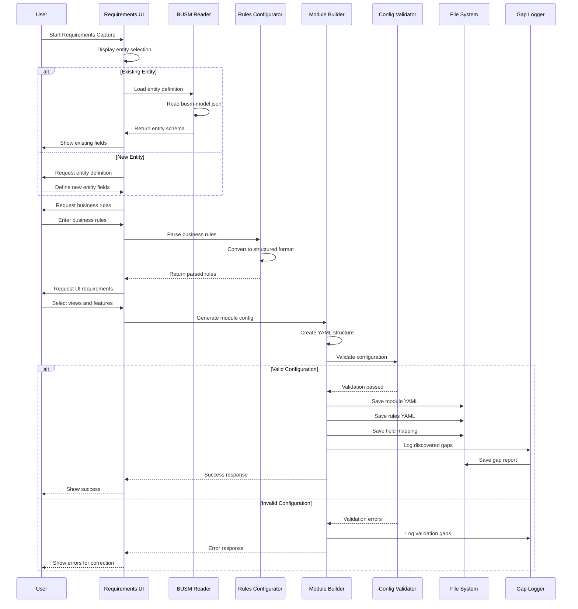

# STAGE 1: REQUIREMENTS CAPTURE
## Detailed Process Definition

### PURPOSE
Transform business needs into structured, machine-readable configuration files that drive the entire factory pipeline.

### STAGE BOUNDARIES
- **START**: Business stakeholder has a need
- **END**: Valid YAML configuration files ready for processing

### INPUTS (Required)
| Input | Type | Source | Format | Example |
|-------|------|--------|--------|---------|
| Business Entity Name | String | User | Text | "Account" |
| Entity Description | String | User | Text | "Customer account for service delivery" |
| Field Definitions | Array | User/BUSM | Structured | [{name: "accountNumber", type: "string", required: true}] |
| Business Rules | Array | User | Natural Language | ["Account number must be unique", "Balance cannot be negative"] |
| UI Requirements | Object | User | Structured | {views: ["list", "detail", "create"], features: ["search", "filter"]} |
| Phase Number | Integer | User | Number | 1 |
| Iteration Context | Object | System | JSON | {previousPhases: [], dependencies: []} |

### OUTPUTS (Guaranteed)
| Output | Type | Location | Format | Validation |
|--------|------|----------|--------|------------|
| Module Configuration | YAML | `.pipeline/factory-tools/module-system/{entity}-phase{n}.yaml` | YAML | Schema validation |
| Business Rules Config | YAML | `.pipeline/factory-tools/business-rules/{entity}-rules.yaml` | YAML | Rule parser validation |
| Field Mapping | JSON | `.pipeline/factory-tools/mappings/{entity}-fields.json` | JSON | Type checking |
| Gap Report | JSON | `.pipeline/gaps/stage1-{timestamp}.json` | JSON | Gap schema |
| Process Log | JSON | `.pipeline/logs/stage1-{timestamp}.json` | JSON | Log schema |

### TOOLS INVOLVED
1. **BUSM Reader** (`busm-reader.js`)
   - Role: Load and validate entity definitions from BUSM
   - Status: ✅ Complete
   
2. **Business Rules Configurator** (`rules-cli.js`)
   - Role: Interactive rule definition and validation
   - Status: ✅ Complete
   
3. **Module Builder** (`module-builder.js`)
   - Role: Generate module YAML from inputs
   - Status: ✅ Complete
   
4. **Requirements Capture UI** 
   - Role: Web interface for gathering requirements
   - Status: ❌ MISSING - Need to build

### DETAILED SEQUENCE DIAGRAM



### SUB-PROCESSES

#### 1.1 Entity Definition
```
Input: Entity name and description
Process:
  1. Check if entity exists in BUSM
  2. If exists: Load and display current definition
  3. If new: Create new entity structure
  4. For each field:
     a. Define name, type, required flag
     b. Add constraints (min/max, pattern, etc.)
     c. Add description
     d. Check for dependencies
Output: Complete entity schema
```

#### 1.2 Business Rules Definition
```
Input: Natural language rules
Process:
  1. Parse each rule statement
  2. Identify:
     - Rule type (validation, calculation, workflow)
     - Affected fields
     - Conditions
     - Actions
  3. Convert to structured format:
     {
       id: "rule_001",
       type: "validation",
       field: "accountNumber",
       condition: "on_create",
       expression: "unique(accountNumber)",
       message: "Account number must be unique"
     }
Output: Structured rules array
```

#### 1.3 UI Requirements Specification
```
Input: View and feature requirements
Process:
  1. Select view types needed:
     - List view
     - Detail view
     - Create/Edit forms
  2. For each view:
     a. Define visible fields
     b. Define actions available
     c. Define filters/search
  3. Specify layout preferences
Output: UI specification object
```

### GAP DISCOVERY POINTS

| Check Point | What We Check | Gap Type | Severity |
|-------------|---------------|----------|----------|
| Entity Fields | All required fields defined | MISSING_FIELD | HIGH |
| Field Types | Valid TypeScript types | INVALID_TYPE | HIGH |
| Business Rules | All rules have valid syntax | INVALID_RULE | MEDIUM |
| Rule Coverage | All validations covered | MISSING_VALIDATION | MEDIUM |
| UI Coverage | All CRUD operations covered | MISSING_VIEW | LOW |
| Field Mapping | All fields have UI representation | UNMAPPED_FIELD | LOW |

### PROCESS VALIDATION CRITERIA

✅ **Stage is complete when:**
1. Module YAML file exists and is valid
2. All required fields are defined
3. At least one business rule is defined
4. At least one view is specified
5. Gap report is generated (even if empty)
6. Process log is complete

❌ **Stage fails if:**
1. No entity name provided
2. No fields defined
3. YAML generation fails
4. File write fails
5. Critical validation errors

### AUTOMATION STATUS

| Task | Current | Target | Gap |
|------|---------|--------|-----|
| Entity Loading | ✅ Automated (CLI) | ✅ Automated (UI) | Need UI |
| Field Definition | ⚠️ Manual (YAML edit) | ✅ Automated (UI) | Need UI |
| Rule Definition | ✅ Semi-automated (CLI) | ✅ Automated (UI) | Need UI |
| Module Generation | ✅ Automated | ✅ Automated | Complete |
| Validation | ✅ Automated | ✅ Automated | Complete |
| Gap Discovery | ✅ Automated | ✅ Automated | Complete |

### METRICS TO TRACK

| Metric | Target | Measurement |
|--------|--------|-------------|
| Time to Complete | < 5 minutes | End-to-end timer |
| Field Completeness | 100% | Required fields / Total fields |
| Rule Coverage | > 80% | Rules defined / Fields needing rules |
| First-Time Success | > 90% | Successful runs / Total runs |
| Gap Discovery Rate | 100% | Gaps found / Known gaps |

### ERROR HANDLING

| Error Type | Handling | Recovery |
|------------|----------|----------|
| Invalid Entity Name | Show error, suggest valid names | User correction |
| Missing Required Field | Highlight field, block progress | User provides field |
| Invalid Rule Syntax | Show parser error, provide example | User fixes syntax |
| File Write Failure | Retry 3x, then show error | Manual intervention |
| BUSM Load Failure | Use empty template | Continue with manual entry |

### NEXT STEPS TO MAKE REPEATABLE

1. **BUILD Requirements Capture UI** (Priority: HIGH)
   - Web form for entity definition
   - Interactive rule builder
   - View selector interface
   - Real-time validation
   
2. **CREATE Stage Orchestrator** (Priority: HIGH)
   - Coordinate all tool calls
   - Manage intermediate files
   - Handle retries and errors
   
3. **ADD Process Templates** (Priority: MEDIUM)
   - Common entity patterns
   - Standard rule sets
   - Default UI layouts

### SAMPLE EXECUTION COMMAND

```bash
# Current (Manual)
node .pipeline/factory-tools/module-system/module-builder.js \
  --entity Account \
  --phase 1 \
  --rules account-rules.yaml

# Target (Automated)
npm run concept:stage1
# Opens UI at http://localhost:3001/requirements
# User fills form
# Automatic file generation
```

### CONNECTION TO STAGE 2

Stage 1 outputs become Stage 2 inputs:
- `{entity}-phase{n}.yaml` → Module Parser input
- `{entity}-rules.yaml` → Rules Parser input  
- `{entity}-fields.json` → Type Generator input
- `stage1-gaps.json` → Gap Aggregator input

---

*Stage 1 Process Definition v1.0*
*Status: REQUIRES UI COMPONENT*
*Next: Build Requirements Capture UI*