# 🏭 Configuration-Driven UI Factory: End-to-End Process Flow

## Overview: Configuration-First Progressive Factory

```
VIEWFORGE CONFIGURATOR ──→ JSON CONFIGS ──→ GENERATORS ──→ UI OUTPUT
     (Visual Tool)        (Single Truth)    (3 Lines)     (HTML/React/Vue)

CONCEPT LINE ──→ PROTOTYPE LINE ──→ PRODUCTION LINE
   (HTML)           (React)            (Vue)
   Fast Demo       Working App       Enterprise
   80% Config      80% Config        80% Config
   20% Manual      20% Agents        20% Complex
```

---

## 📊 Complete Process Flow Visualization

```mermaid
graph TB
    %% Starting Point
    Start([Business Need:<br/>Pest Control System]) --> Config[ViewForge Configurator<br/>configurator.html]
    
    %% Configuration-Driven Approach
    Config --> ConfigTypes{Entity Configuration}
    ConfigTypes --> Account[Account Entity<br/>✅ Partially Done]
    ConfigTypes --> ServiceLoc[Service Location<br/>❌ Needed]
    ConfigTypes --> WorkOrder[Work Order<br/>❌ Needed]
    
    %% JSON Configuration Storage
    Account --> JSON1[field-config-account-*.json<br/>.pipeline/02-configurations/entities/]
    ServiceLoc --> JSON2[field-config-service-location-*.json<br/>.pipeline/02-configurations/entities/]
    WorkOrder --> JSON3[field-config-work-order-*.json<br/>.pipeline/02-configurations/entities/]
    
    %% IMS Integration
    JSON1 --> IMS[IMS: Create Iteration<br/>ITER-2025-08-21-007<br/>Line: Concept]
    JSON2 --> IMS
    JSON3 --> IMS
    
    %% CONCEPT LINE
    IMS --> CL[CONCEPT LINE]
    
    subgraph "🎨 CONCEPT LINE (Configuration-Driven HTML)"
        %% Pure Configuration Phase
        CL --> VF1[ViewForge Output<br/>JSON Configurations]
        VF1 --> NavConfig[Navigation Config<br/>nav-config-pest-control-v1.json<br/>Role-based menus]
        VF1 --> LayoutConfig[Layout Config<br/>layout-config-sample.json<br/>3-column layout]
        
        %% Generation Phase (80% Config)
        VF1 --> HG[HTML Generator<br/>simple-html-generator.js]
        NavConfig --> NG[Navigation Generator<br/>navigation-generator.js]
        LayoutConfig --> LG[Layout Generator<br/>layout-generator.js]
        
        %% Output Assembly
        HG --> Views[Entity Views:<br/>- account-list.html<br/>- service-location-list.html<br/>- work-order-list.html]
        NG --> Nav[Navigation HTML:<br/>Role-aware menus]
        LG --> App[Complete App:<br/>pest-control-app.html]
        Views --> App
        Nav --> App
        
        %% Testing & Validation
        App --> Demo[Demo Files:<br/>pest-control-navigation-demo.html<br/>context-navigation-demo.html]
        Demo --> CT[Manual Testing:<br/>- Visual validation<br/>- Navigation flow<br/>- User feedback]
        CT --> CV{Validation<br/>Passed?}
        CV -->|No| Config
        CV -->|Yes| CP[IMS: Complete Iteration<br/>Archive & Tag Golden]
    end
    
    %% PROMOTION TO PROTOTYPE
    CP --> PR1[IMS: Promote to Prototype<br/>ITER-XXXX-XXX<br/>Line: Prototype]
    
    %% PROTOTYPE LINE
    subgraph "⚛️ PROTOTYPE LINE (80% Config + 20% Agents)"
        %% Configs Carry Forward
        PR1 --> VF2[Same ViewForge Configs<br/>No re-configuration needed]
        VF2 --> CF2[Enhanced with:<br/>+ Supabase endpoints<br/>+ State requirements<br/>+ Validation rules]
        
        %% Agent-Based Enhancement (20%)
        CF2 --> SB[Story Builder Agent<br/>.sdlc/01-core/A-agents/story-builder-v21.md]
        SB --> US[Generated Stories:<br/>US-006-service-locations.md<br/>US-007-work-orders.md]
        
        %% Processor Pipeline (When Needed)
        US --> PS[Processor Selector<br/>For complex components only]
        PS --> TP[Type Processor<br/>.sdlc/01-core/A-agents/processors/type-processor.md]
        PS --> SP[Scaffold Processor<br/>.sdlc/01-core/A-agents/processors/scaffold-processor.md]
        PS --> RP[React Processor<br/>.sdlc/01-core/A-agents/processors/react-processor.md]
        PS --> HP[Hook Processor<br/>.sdlc/01-core/A-agents/processors/hook-processor.md]
        
        %% React Generation (80% from Config)
        CF2 --> RG[React Generator<br/>pattern-based-generator.js]
        RG --> RC[React Components:<br/>Generated from configs]
        
        %% Integration with Supabase
        RC --> SDB[Supabase Integration:<br/>- Tables created<br/>- RLS policies<br/>- Edge functions]
        SDB --> RI[React App:<br/>Working with real data]
        
        %% Validation
        RI --> PT[Testing:<br/>- Component tests<br/>- Supabase queries<br/>- Performance metrics]
        PT --> PV{Validation<br/>Passed?}
        PV -->|No| CF2
        PV -->|Yes| PP[IMS: Complete Iteration<br/>Ready for Production]
    end
    
    %% PROMOTION TO PRODUCTION
    PP --> PR2[IMS: Promote to Production<br/>ITER-2025-01-21-003<br/>Line: Production]
    
    %% PRODUCTION LINE
    subgraph "🚀 PRODUCTION LINE (Vue + Enterprise)"
        %% Final Configuration
        PR2 --> VF3[ViewForge Configurator<br/>Configs from Prototype]
        VF3 --> CF3[Production Configs:<br/>+ Multi-tenant<br/>+ Security layers<br/>+ Audit trails]
        
        %% Full Rules Implementation
        CF3 --> RM3[Rules Manager<br/>Complete rule set]
        RM3 --> BR3[Full Business Rules:<br/>+ Role-based access<br/>+ Audit logging<br/>+ Compliance rules<br/>+ Complex workflows]
        RM3 --> TR3[Full Technical Rules:<br/>+ p95 <500ms<br/>+ CDN caching<br/>+ Rate limiting<br/>+ Circuit breakers]
        
        %% Production Processors
        BR3 --> VG[Vue Generator<br/>vue-processor.md]
        TR3 --> VG
        CF3 --> VG
        VG --> VO[Vue Components:<br/>AccountList.vue<br/>AccountDetail.vue<br/>AccountForm.vue]
        
        %% Additional Production Elements
        BR3 --> SG[Security Generator]
        SG --> SO[Security Layer:<br/>- RBAC<br/>- Field encryption<br/>- PII masking]
        
        TR3 --> PG[Performance Generator]
        PG --> PO[Performance Layer:<br/>- Virtual scrolling<br/>- Request coalescing<br/>- CDN integration]
        
        %% Production App
        VO --> VA[Vue Application:<br/>Enterprise-ready<br/>Fully secured<br/>Optimized]
        SO --> VA
        PO --> VA
        
        %% Final Validation
        VA --> FT[Production Testing:<br/>- Security audit<br/>- Load testing<br/>- Compliance check<br/>- UAT]
        FT --> FV{Production<br/>Ready?}
        FV -->|No| VF3
        FV -->|Yes| Deploy[Deploy to Production]
    end
    
    %% Feedback Loop
    Deploy --> Metrics[Production Metrics:<br/>- Performance<br/>- Usage patterns<br/>- Error rates]
    Metrics --> Learnings[Captured Learnings]
    Learnings --> Start
```



---

## 🔄 Detailed Process Breakdown by Line

### CONCEPT LINE (Current Focus - Day 1)
**Purpose**: Rapid validation with configuration-driven approach

| Step | Tool/Location | Input | Output | Time | Status |
|------|--------------|-------|--------|------|--------|
| 1. Open ViewForge | `.pipeline/01-factory-tools/viewforge/configurator.html` | Business requirements | Visual configurator | Instant | ✅ Ready |
| 2. Configure Account | Drag & drop fields | Entity structure | `field-config-account-*.json` | 15 min | ✅ Done |
| 3. Configure Service Location | Drag & drop fields | Entity structure | `field-config-service-location-*.json` | 15 min | ❌ Needed |
| 4. Configure Work Order | Drag & drop fields | Entity structure | `field-config-work-order-*.json` | 15 min | ❌ Needed |
| 5. Generate HTML Views | `simple-html-generator.js` | JSON configs | HTML views | 1 min each | ⏳ Partial |
| 6. Generate Navigation | `navigation-generator.js` | `nav-config-pest-control-v1.json` | Role-based nav | 1 min | ✅ Done |
| 7. Generate Layout | `layout-generator.js` | Layout config | Complete app | 1 min | ✅ Ready |
| 8. Test Complete App | Browser | `pest-control-app.html` | User feedback | 30 min | ⏳ Waiting |
| 9. Create/Update Iteration | `iteration-manager.js` | Test results | `ITER-2025-08-21-007` | 1 min | ✅ Active |

**Total Time**: ~90 minutes for complete system (3 entities)

---

### PROTOTYPE LINE (Day 2-3)
**Purpose**: Working application with real Supabase data

| Step | Tool/Agent | Input | Output | Time |
|------|------------|-------|--------|------|
| 1. Promote Iteration | `iteration-manager.js` | Concept configs | New iteration | 1 min |
| 2. **Use Same Configs** | No changes needed | ViewForge JSONs | Same configs | 0 min |
| 3. Setup Supabase | MCP Supabase tools | Schema from configs | Tables, RLS | 30 min |
| 4. Generate React (80%) | `pattern-based-generator.js` | JSON configs | React components | 5 min |
| 5. Complex Features (20%) | Story Builder + Processors | Special requirements | Enhanced components | 30 min |
| 6. Connect to Supabase | Manual integration | API keys | Working data layer | 15 min |
| 7. Test with Real Data | Browser + Supabase | React app | Functional prototype | 1 hour |
| 8. Complete Iteration | `iteration-manager.js` | Test results | Validated prototype | 1 min |

**Total Time**: ~2.5 hours (configs reused from Concept)

---

### PRODUCTION LINE (Week 2)
**Purpose**: Enterprise-ready deployment

| Step | Tool/Agent | Input | Output | Time |
|------|------------|-------|--------|------|
| 1. Promote Iteration | IMS | Prototype iteration | ITER-XXX-003 | 1 min |
| 2. Production Configs | ViewForge | Prototype configs | Multi-tenant configs | 30 min |
| 3. Complete Rules | Rules Manager | Prototype rules | Full RBAC, audit, compliance | 1 hour |
| 4. Generate Vue | Vue Processor | Configs + Rules | Vue components | 30 min |
| 5. Security Layer | Security Generator | Security rules | RBAC, encryption | 30 min |
| 6. Performance Layer | Performance Generator | Performance rules | Caching, CDN config | 30 min |
| 7. Integration | Manual | All components | Complete Vue app | 2 hours |
| 8. Security Testing | Security Scanner | Vue app | Security report | 1 hour |
| 9. Load Testing | Load Test Tools | Vue app | Performance report | 1 hour |
| 10. UAT | Business Users | Vue app | Approval | 2 hours |
| 11. Deploy | Deployment Pipeline | Approved app | Production deployment | 30 min |

**Total Time**: ~10 hours per entity

---

## 📦 Current Directory Structure & Outputs

### Factory Organization (Reorganized Today)
```
.pipeline/
├── 01-factory-tools/           # THE FACTORY - Tools that build
│   ├── viewforge/             # ✅ Visual configurator (working)
│   │   └── configurator.html
│   ├── generators/            # ✅ All generators (working)
│   │   ├── simple-html-generator.js
│   │   ├── navigation-generator.js
│   │   ├── layout-generator.js
│   │   └── pattern-based-generator.js
│   └── ims/                   # ✅ Iteration Management System
│       └── iteration-manager.js
│
├── 02-configurations/          # INPUTS - Source of truth
│   ├── entities/
│   │   ├── account/           # ✅ Partially configured
│   │   │   └── field-config-account-list-view-*.json
│   │   ├── service-location/  # ❌ Needs configuration
│   │   └── work-order/        # ❌ Needs configuration
│   ├── navigation/            # ✅ Complete
│   │   └── nav-config-pest-control-v1.json
│   └── layouts/              # ✅ Ready
│       └── layout-config-sample.json
│
├── 03-generated/              # OUTPUTS - What gets produced
│   ├── concept-line/         # Current focus
│   │   ├── views/           # Entity HTML views
│   │   ├── navigation/      # Generated nav
│   │   └── complete-apps/  # Full applications
│   ├── prototype-line/      # Future (React)
│   └── production-line/     # Future (Vue)
│
├── 04-testing/               # VALIDATION
│   └── demos/
│       ├── pest-control-navigation-demo.html  # ✅ Working
│       └── context-navigation-demo.html       # ✅ Working
│
└── iterations/               # VERSION CONTROL
    └── archive/
        └── ITER-2025-08-21-007/  # ✅ Current active iteration
            ├── metadata.json
            ├── changelog.md
            ├── configs/          # Snapshot of configs
            ├── generated/        # Generated artifacts
            └── rules/           # Business rules
```

---

## 🔑 Key Paradigm Shift: Configuration-Driven Factory

### What Changed from Traditional Approach
| Aspect | Old Way | New Way (Today) |
|--------|---------|-----------------|
| **UI Definition** | Code everything manually | ViewForge visual configuration |
| **Source of Truth** | Scattered in code | JSON configurations |
| **Consistency** | Hope developers follow patterns | Guaranteed by generators |
| **Changes** | Edit multiple files | Update config, regenerate |
| **Time to Demo** | Days/weeks | 90 minutes |
| **Automation** | Little to none | 80% configuration-driven |

### The 80/20 Rule in Practice
- **80% Configuration**: Standard CRUD views, forms, lists, navigation
- **20% Custom**: Complex business logic, special interactions, integrations

### Configuration Reuse Across Lines
```
ViewForge Config (Once) → Concept HTML → Prototype React → Production Vue
                           ↑________↑________↑
                           Same JSON configs flow through
```

### Time Savings Breakdown
- **Traditional**: 40-60 hours per entity full stack
- **Our Factory**: 
  - Concept: 30 min config + 1 min generate = 31 min
  - Prototype: 0 min config (reused) + 30 min enhance = 30 min
  - Production: 0 min config (reused) + 2 hours polish = 2 hours
  - **Total: ~3 hours vs 40-60 hours = 93% reduction**

---

## 🎯 Current Status & Next Actions

### Where We Are Now (January 21, 2025)
| Component | Status | Location | Action Needed |
|-----------|--------|----------|---------------|
| **ViewForge** | ✅ Working | `.pipeline/01-factory-tools/viewforge/configurator.html` | Use it |
| **Account Config** | ✅ Partial | `.pipeline/02-configurations/entities/account/` | Add detail/form views |
| **Service Location** | ❌ Empty | `.pipeline/02-configurations/entities/service-location/` | Configure in ViewForge |
| **Work Order** | ❌ Empty | `.pipeline/02-configurations/entities/work-order/` | Configure in ViewForge |
| **HTML Generator** | ✅ Ready | `.pipeline/01-factory-tools/generators/simple-html-generator.js` | Run after configs |
| **Navigation** | ✅ Complete | `.pipeline/02-configurations/navigation/nav-config-pest-control-v1.json` | Already configured |
| **Layout Generator** | ✅ Ready | `.pipeline/01-factory-tools/generators/layout-generator.js` | Run to assemble |
| **Current Iteration** | ✅ Active | `.pipeline/iterations/archive/ITER-2025-08-21-007/` | Update with progress |

### Immediate Next Steps (In Order)
1. **Open ViewForge** → Configure Service Location entity
2. **Open ViewForge** → Configure Work Order entity  
3. **Run Generators** → Create all HTML views
4. **Run Layout Generator** → Assemble complete pest control app
5. **Test in Browser** → Validate the complete system
6. **Update Iteration** → Mark as golden if successful

---

## 🚀 Quick Start Commands

### To Complete Concept Line Today:
```bash
# 1. Configure entities (manual - open in browser)
open .pipeline/01-factory-tools/viewforge/configurator.html

# 2. Generate HTML views (after configuring)
cd .pipeline/01-factory-tools/generators

# For Service Location
node simple-html-generator.js ../../02-configurations/entities/service-location/list-view.json ../../03-generated/concept-line/views/service-location-list.html

# For Work Order  
node simple-html-generator.js ../../02-configurations/entities/work-order/list-view.json ../../03-generated/concept-line/views/work-order-list.html

# 3. Generate complete app with navigation
node layout-generator.js ../../02-configurations/layouts/layout-config-sample.json ../../03-generated/concept-line/complete-apps/pest-control-complete.html

# 4. Test the result
open .pipeline/03-generated/concept-line/complete-apps/pest-control-complete.html

# 5. Update iteration status
node ../ims/iteration-manager.js complete ITER-2025-08-21-007
```

## 📚 Key Principles to Remember

1. **Configure Once, Use Everywhere**: ViewForge configs flow through all lines
2. **80/20 Rule**: 80% standard UI from config, 20% custom code when needed
3. **Progressive Enhancement**: Start simple (HTML), add complexity (React), enterprise-ready (Vue)
4. **No Rework**: Configs carry forward, no re-implementation
5. **Rapid Validation**: See results in minutes, not days

---

*Last Updated: January 21, 2025 - Configuration-Driven Factory Model*