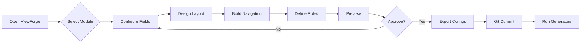

# ViewForge 2.0: Integrated Configuration Platform
*The Foundation of Everything*

## 🎯 Vision
ViewForge is THE visual configuration platform that drives the entire factory. It's not just a field configurator - it's a comprehensive UI design system that outputs JSON configurations for all generators.

## 🏗️ Architecture

```
ViewForge 2.0
├── Field Configurator (with relationships)
├── Layout Designer (drag-drop layouts)
├── Navigation Builder (role-based menus)
├── Rules Editor (business & technical)
├── Preview Engine (B&W for Concept, styled for others)
└── Version Control (built-in Git integration)
```

## 📱 Application Modules

### 1. Field Configurator
**What we have:** Basic field selection
**What we need:** 
- ✅ Multiple entity tabs (Account, Contact, Service Location, etc.)
- ✅ Relationship support (account.contact.firstName)
- ✅ BUSM integration (load actual field names)
- ✅ Module/Sub-module awareness
- ✅ Context selector (List View, Detail View, Form View)

**Implementation:**
- Restore from `field-selector-with-relations-mockup.html`
- Add BUSM field name loader
- Support dot notation for relationships
- Limit to single joins initially (as you mentioned)

### 2. Layout Designer (NEW)
**Purpose:** Visual layout configuration for complete applications
**Features:**
- Drag-drop layout zones (header, nav, main, sidebar, footer)
- Component placement (which view goes where)
- Responsive breakpoints
- Output: layout-config.json

### 3. Navigation Builder (NEW)
**Purpose:** Role-based navigation configuration
**Features:**
- Module hierarchy (Accounts → Master View → List)
- Role assignment (Owner, Manager, Technician)
- Time-based rules (morning vs afternoon)
- Output: nav-config.json

### 4. Rules Editor (NEW)
**Purpose:** Define business and technical rules
**Features:**
- Business rules (validations, workflows)
- Technical rules (performance, caching)
- Progressive rules (Concept → Prototype → Production)
- Output: rules-config.json

### 5. Preview Engine
**Purpose:** See what will be generated
**Critical Feature:** LINE-AWARE PREVIEW
- Concept Line: PURE BLACK & WHITE
- Prototype Line: Basic colors
- Production Line: Full styling

## 🔄 Workflow Integration



## 💾 Version Control Integration

### Automatic Git Operations
```javascript
// Every export triggers:
1. Save to .pipeline/02-configurations/
2. Git add
3. Git commit with message
4. Tag with viewforge-v[timestamp]
```

### Config Versioning
```json
{
  "version": "2.0.0",
  "created": "2025-01-21T10:00:00Z",
  "modified": "2025-01-21T10:30:00Z",
  "previousVersion": "1.9.0",
  "changeLog": [
    "Added service location fields",
    "Updated account relationships"
  ]
}
```

## 🎨 UI Design Principles

### For ViewForge Itself
1. **Clean & Professional** - This is a developer tool
2. **Efficient** - Keyboard shortcuts for power users
3. **Visual** - See what you're building
4. **Integrated** - All configuration in one place

### For Generated Output
1. **Concept Line** - BLACK & WHITE ONLY (enforced)
2. **Prototype Line** - Basic colors, simple styling
3. **Production Line** - Full design system

## 🚀 Implementation Plan

### Phase 1: Restore & Enhance Field Configurator (TODAY)
1. Copy `field-selector-with-relations-mockup.html` to ViewForge
2. Add BUSM field integration
3. Add B&W enforcement for Concept Line
4. Test with Service Location relationships

### Phase 2: Add Layout Designer (This Week)
1. Create drag-drop layout zones
2. Component placement system
3. Export layout-config.json
4. Integrate with layout-generator.js

### Phase 3: Navigation & Rules (Next Week)
1. Navigation builder with role support
2. Rules editor with progressive enhancement
3. Full integration testing

### Phase 4: Version Control (Following Week)
1. Git integration
2. Config history viewer
3. Rollback capability

## 🔒 Critical Enforcements

### 1. B&W Enforcement for Concept Line
```javascript
// In ViewForge
if (selectedLine === 'concept') {
    disableAllStylingOptions();
    preview.classList.add('concept-line-preview');
    showWarning('Concept Line: Black & White Only');
}
```

### 2. BUSM Field Validation
```javascript
// Validate all field names against BUSM
validateField(fieldPath) {
    return BUSM_REGISTRY.hasField(fieldPath);
}
```

### 3. Relationship Depth Limit
```javascript
// Initially limit to single joins
if (fieldPath.split('.').length > 3) {
    showError('Maximum relationship depth exceeded');
}
```

## 📊 Success Metrics

1. **Time to Configure**: < 5 minutes per entity
2. **Rework Rate**: < 5% (configs work first time)
3. **Adoption**: All team members use ViewForge
4. **Version Recovery**: Can restore any previous config
5. **Principle Compliance**: 100% B&W for Concept Line

## 💡 Key Innovation

ViewForge becomes the **Single Source of Truth** for all UI configuration. No more:
- Manual JSON editing
- Lost configurations  
- Principle violations
- Inconsistent field names
- Missing relationships

Everything flows from ViewForge → JSON → Generators → UI

## 🎬 Next Immediate Steps

1. **NOW**: Restore relationship support from archived version
2. **TODAY**: Add BUSM field name integration
3. **TODAY**: Implement B&W enforcement
4. **TOMORROW**: Begin layout designer
5. **THIS WEEK**: Full ViewForge 2.0 operational

---

*"Invest in the tools that build tools" - This is our highest leverage work*