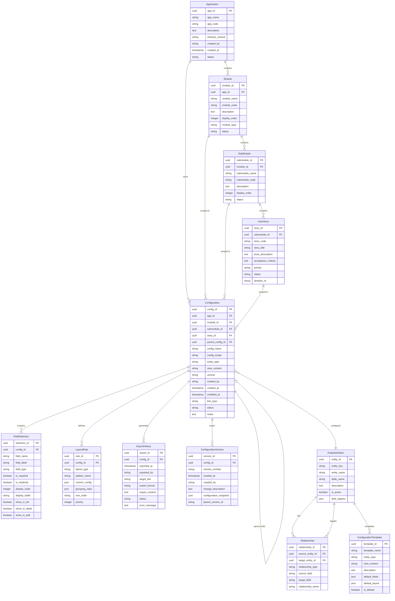

# ViewForge 2.0 Entity Relationship Diagram

## ERD Visualization

## Entity Descriptions

### Hierarchy Entities

**Application**
- Top-level container for an entire application
- Example: "Field Service Management System"
- Groups related modules together
- All configurations belong to an application

**Module**  
- Functional area within an application
- Example: "Customer Management", "Work Order Management"
- Contains submodules for organization
- Can have module-level configurations (e.g., module navigation layout)

**SubModule**
- Logical grouping within a module
- Example: "Customer Accounts", "Customer Contacts", "Customer History"
- Contains related user stories
- Can have submodule-level configurations (e.g., submodule dashboard)

**UserStory**
- Specific feature or requirement
- Example: "As an Admin, I want to view customer details"
- Can have story-level configurations (e.g., specific views for the story)

### Core Entities

**Configuration**
- Represents a UI configuration at any scope level
- **Always** belongs to an Application (required)
- **Optionally** scoped to Module, SubModule, or UserStory (nullable FKs)
- config_scope field indicates level: 'app', 'module', 'submodule', 'story'
- Can have parent-child relationships for composition
- Example: Module layout config has child configs for navigation, header, content areas
- Links to specific entity type and view context
- Tracks lifecycle through status and versioning

**FieldSelection**
- Individual field selections for a configuration
- Controls visibility and display properties per view type
- Maintains display order and formatting

**LayoutRule**
- Defines how fields are arranged and displayed
- Supports different patterns (table, master-detail, etc.)
- JSON fields for flexible rule definitions

### Supporting Entities

**ExportHistory**
- Audit trail of all exports/generations
- Tracks what was generated for which line
- Captures errors for debugging

**ConfigurationVersion**
- Complete version history of configurations
- Enables rollback and comparison
- Stores full snapshot at each save

**EntityDefinition**
- Master registry of available entities
- Stores BUSM field definitions
- Single source of truth for entity metadata

**Relationship**
- Defines relationships between entities
- Enables related field selection (Week 2)
- Supports navigation patterns

**ConfigurationTemplate**
- Pre-built configuration starting points
- Accelerates common configurations
- Defines defaults per entity/view combination

## Key Relationships

1. **Application → Module → SubModule → UserStory**
   - Organizational hierarchy for structuring work
   - Each level provides context and grouping
   - NOT a rigid ownership chain for configurations

2. **Configuration flexible scoping**
   - MUST have: Application (all configs belong to an app)
   - CAN have: Module, SubModule, UserStory (nullable)
   - Scope field indicates level: 'app', 'module', 'submodule', 'story'
   - Examples:
     - App-level: Main navigation config (app_id only)
     - Module-level: Customer module layout (app_id + module_id)
     - Story-level: Customer detail view (app_id + module_id + submodule_id + story_id)

3. **Configuration → Configuration** (Parent-Child)
   - Supports composition patterns
   - Example: Master config "has" Detail config "has" Action config
   - Enables reuse of sub-configurations

3. **Configuration → FieldSelection** (1:Many)
   - A configuration contains multiple field selections
   - Cascade delete when configuration removed

4. **Configuration → EntityDefinition** (Many:1)
   - Each configuration is for one entity
   - Entity definitions can have many configurations

5. **EntityDefinition → Relationship** (1:Many)
   - Entities can have multiple relationships
   - Self-referential for target entity

6. **Configuration → ConfigurationVersion** (1:Many)
   - Track all changes over time
   - Parent-child versioning for branching

## Design Decisions

1. **JSON Fields**: Used for flexible, evolving structures (column_config, field_registry)
2. **UUID Primary Keys**: Globally unique, distributed-friendly
3. **Soft Deletes**: Status field instead of deletion for audit trail
4. **Temporal Data**: All entities track created/modified timestamps
5. **Denormalization**: Some redundancy accepted for query performance

## Questions for Discussion

1. Should we have a separate `User` entity or just track usernames?
2. Is the App → Module → UserStory → Configuration hierarchy right?
3. Should Configuration parent-child be a separate junction table for many-to-many?
4. Do we need a `Feature` level between Module and UserStory?
5. Should `FieldSelection` be more normalized with a `FieldDefinition` table?
6. Do we need `ExportTemplate` for different output formats?
7. Should line progression (concept→prototype→production) be tracked differently?