# Feedback-Driven Development Architecture
**Version**: 1.0  
**Created**: 2025-01-21  
**Status**: Revolutionary Prototype  
**Innovation Level**: 🚀 GAME-CHANGING

## Executive Summary

We have created a revolutionary feedback system that transforms user feedback into working software through an automated pipeline. This is not just a feedback collector - it's a complete **Software Evolution Engine** that treats user feedback as first-class requirements, validates them against a formal data model (BUSM), and automatically generates implementation artifacts.

## The Revolutionary Concept

### Traditional Feedback Flow (What Everyone Else Does)
```
User Feedback → Email/Ticket → PM Reviews → Developer Interprets → Maybe Gets Built → Months Later
```

### Our Innovation (What We Built)
```
User Feedback → Instant Validation → Auto Requirements → Pipeline Processing → Working Prototype → MINUTES
```

## Architecture Overview

```mermaid
graph TB
    subgraph "User Layer"
        A[HTML Concept Page] --> B[Feedback Button 💡]
        B --> C[Context-Aware Form]
    end
    
    subgraph "Collection Layer"
        C --> D[Browser Client]
        D --> E{Storage Strategy}
        E -->|Current| F[localStorage]
        E -->|Future| G[Supabase]
    end
    
    subgraph "Validation Layer"
        F --> H[Feedback Processor]
        G --> H
        H --> I[BUSM Validator]
        I --> J{Valid?}
        J -->|Yes| K[Generate Requirements]
        J -->|No| L[Warning Report]
    end
    
    subgraph "Pipeline Layer"
        K --> M[Requirements Parser]
        M --> N[Story Builder]
        N --> O[Task Planner]
        O --> P[Concept Generator]
    end
    
    subgraph "Output Layer"
        P --> Q[HTML with Changes]
        Q --> R[User Sees Update]
        R --> S[More Feedback]
        S --> B
    end
```



## Key Components

### 1. Feedback Collection System
**Location**: `.pipeline/2-factory/feedback-system/`

#### Components:
- **inject-feedback.js**: Single-line injection for ANY HTML page
- **Context Capture**: Automatically records what user was viewing
- **Smart Classification**: UI, Feature, Bug, Enhancement, Performance
- **Time Estimation**: Immediate feedback on implementation complexity

#### Innovation:
- Zero-friction submission (one click)
- Context-aware (knows what user is looking at)
- Works on ANY HTML without modification

### 2. BUSM (Business Unit Structure Model) Integration
**Location**: `.pipeline/2-factory/contracts/busm-registry.js`

#### Purpose:
- Single source of truth for data model
- Validates that requested fields actually exist
- Generates appropriate mock data
- Ensures implementation feasibility

#### Innovation:
- Feedback is validated BEFORE becoming a requirement
- Mock data is consistent with data model
- Prevents impossible feature requests

### 3. Feedback-to-Requirements Converter
**Location**: `.pipeline/2-factory/feedback-system/feedback-to-requirements.js`

#### Process:
1. Load feedback tasks
2. Validate against BUSM
3. Group by feature area
4. Generate formal requirements specs
5. Create traceability matrix

#### Innovation:
- Feedback becomes FORMAL requirements
- No manual interpretation needed
- Complete traceability from feedback to implementation

### 4. Pipeline Integration
**Location**: `.pipeline/2-factory/processors/`

#### Flow:
- Requirements Parser: Extracts formal requirements
- Story Builder: Creates user stories with BUSM mappings
- Task Planner: Breaks down into implementation tasks
- Concept Generator: Produces working HTML

#### Innovation:
- Feedback follows SAME pipeline as original requirements
- No special cases or one-offs
- Maintains architectural integrity

## Data Flow

### Current Implementation (localStorage)
```javascript
User Input → localStorage → Manual Export → JSON → Requirements → Pipeline
```

### Proposed Enhancement (Supabase)
```javascript
User Input → Supabase → Webhook → Auto-Process → Requirements → Pipeline → Real-time Updates
```

## Database Schema (Proposed)

```sql
feedback_submissions
├── id (UUID)
├── description (TEXT)
├── type (ENUM)
├── priority (ENUM)
├── context (JSONB)
├── busm_validation (JSONB)
├── requirement_id (FK)
└── status (ENUM)

feedback_requirements
├── id (UUID)
├── feedback_id (FK)
├── requirement_spec (TEXT)
├── busm_mappings (JSONB)
└── mock_data (JSONB)

feedback_implementations
├── id (UUID)
├── requirement_id (FK)
├── status (ENUM)
└── validation_results (JSONB)
```

## Revolutionary Aspects

### 1. Feedback as First-Class Requirements
- Not suggestions or tickets
- Actual requirements that flow through development pipeline
- Same rigor as original specifications

### 2. Automatic Validation
- Every feedback item checked against data model
- Impossible requests identified immediately
- Valid requests get mock data automatically

### 3. Zero Manual Steps (with Supabase)
- User submits → System processes → Prototype updates
- No human interpretation required
- No meetings, no discussions, no delays

### 4. Complete Traceability
```
Feedback#123 → Requirement#FB-REQ-001 → Story#US-101 → Task#T-501 → Implementation#v2.1
```

### 5. Time-to-Prototype: MINUTES
- Traditional: Months
- Our System: Minutes to hours
- 100-1000x faster feedback loop

## Use Cases

### 1. Rapid Prototyping Session
- Stakeholders submit feedback during demo
- Changes appear in real-time
- Iterate 10x faster than traditional methods

### 2. User Testing
- Users interact with prototype
- Submit feedback without leaving context
- See their ideas implemented immediately

### 3. Production Enhancement
- Production users submit feedback
- System validates feasibility
- Priority emerges from frequency
- Most-wanted features bubble up

## Benefits

### For Developers
- Never guess what to build
- Requirements are pre-validated
- Mock data provided automatically
- Clear implementation path

### For Product Managers
- See what users actually want
- Track feedback patterns
- Measure feature demand
- Data-driven prioritization

### For Users
- Ideas heard immediately
- See changes quickly
- Feel invested in product
- Direct impact on development

### For Business
- 100x faster iteration
- Reduced development waste
- Higher user satisfaction
- Data-driven product evolution

## Future Enhancements

### Phase 1: Supabase Integration (Next)
- Real-time feedback storage
- Webhook processing
- Live dashboard
- Multi-user collaboration

### Phase 2: Intelligence Layer
- Duplicate detection
- Similar feedback grouping
- Auto-prioritization
- Cost estimation

### Phase 3: AI Enhancement
- Natural language processing
- Automatic requirement generation
- Implementation suggestion
- Code generation hints

### Phase 4: Marketplace
- Users vote on features
- Token/point system
- Crowdsourced prioritization
- Implementation bounties

## Metrics & Success Criteria

### Current Metrics (Manual)
- Feedback items: 4 collected
- Processing time: ~5 minutes
- Requirements generated: 4
- BUSM validation: 100% success

### Target Metrics (Automated)
- Feedback velocity: 100+ items/day
- Processing time: <10 seconds
- Auto-implementation rate: 60%+
- User satisfaction: 10x improvement

## Technical Considerations

### Scalability
- localStorage: Hundreds of items
- Supabase: Millions of items
- Pipeline: Parallel processing capable

### Security
- Row-level security in Supabase
- Authentication for feedback submission
- Validation prevents injection attacks

### Performance
- Client-side: Instant feedback
- Server-side: Async processing
- Pipeline: Batch optimization

## Questions for Claude

1. **Architecture Validation**: Are there any architectural concerns or improvements you would suggest?

2. **BUSM Integration**: Should the BUSM validation be more sophisticated? Should we add semantic understanding?

3. **Pipeline Optimization**: How can we make the requirements pipeline even more intelligent?

4. **Supabase Design**: Is our proposed schema optimal? Should we add more tables or relationships?

5. **AI Integration**: Where would AI add the most value in this system?

6. **Scaling Concerns**: What challenges might we face at 1000x scale?

7. **Missing Pieces**: What critical components are we overlooking?

8. **Innovation Potential**: How can we make this even MORE revolutionary?

## Conclusion

We have built something that could fundamentally change how software is developed. By treating user feedback as first-class requirements and automating the entire pipeline from feedback to implementation, we've created a system that could make software development 100x more responsive to user needs.

This is not just a feedback system - it's a new paradigm for user-driven development.

## Call to Action

Let's get Claude's input on:
1. Architectural improvements
2. Scaling strategies
3. AI integration points
4. Missing components
5. How to make this even more powerful

---

*"The best way to predict the future is to invent it."* - Alan Kay

*We're not predicting - we're building it!* 🚀