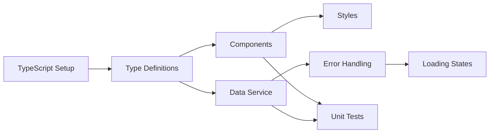

# Prototype Work Items: 1.1.1 Master View
**Generated By**: PLANNER Agent (Simulated)  
**Input**: US-1.1.1-master-view.md  
**Target Line**: Prototype  
**Estimated Effort**: 8 hours

## 📋 Work Items

### 1. Setup TypeScript Infrastructure
**Priority**: P0 - Blocker  
**Effort**: 1 hour  
**Tasks**:
- [x] Create tsconfig.json with strict mode
- [x] Setup package.json with dependencies
- [x] Configure build scripts
- [ ] Setup Jest for testing

### 2. Create Type Definitions
**Priority**: P0 - Blocker  
**Effort**: 1 hour  
**Tasks**:
- [x] Define Account interface
- [x] Define ServiceLocation interface
- [x] Define WorkOrder interface
- [x] Define MasterViewState interface
- [x] Define event types and payloads

### 3. Convert HTML to TypeScript Components
**Priority**: P1 - Critical  
**Effort**: 3 hours  
**Tasks**:
- [ ] Create MasterView.ts main component
- [ ] Create AccountColumn.ts component
- [ ] Create LocationColumn.ts component
- [ ] Create WorkOrderColumn.ts component
- [ ] Create SearchBox.ts component

### 4. Extract and Modularize Styles
**Priority**: P1 - Critical  
**Effort**: 1 hour  
**Tasks**:
- [ ] Create master-view.css
- [ ] Create column.css
- [ ] Create card.css
- [ ] Create search.css
- [ ] Remove all inline styles

### 5. Implement Data Service Layer
**Priority**: P1 - Critical  
**Effort**: 1 hour  
**Tasks**:
- [ ] Create DataService.ts
- [ ] Move mock data to service
- [ ] Add loading state simulation
- [ ] Add error state simulation
- [ ] Add retry logic

### 6. Add Error Handling
**Priority**: P1 - Critical  
**Effort**: 0.5 hours  
**Tasks**:
- [ ] Add try-catch blocks
- [ ] Create error display component
- [ ] Add fallback UI for failures
- [ ] Log errors appropriately

### 7. Create Unit Tests
**Priority**: P1 - Critical  
**Effort**: 2 hours  
**Tasks**:
- [ ] Test type definitions
- [ ] Test data service
- [ ] Test search functionality
- [ ] Test selection logic
- [ ] Test event emission
- [ ] Achieve 60% coverage

### 8. Add Loading States
**Priority**: P2 - Important  
**Effort**: 0.5 hours  
**Tasks**:
- [ ] Create loading spinner component
- [ ] Add skeleton screens
- [ ] Show loading during data fetch
- [ ] Disable interactions while loading

## 📊 Processor Assignment

Based on work items, these processors should run:

1. **TYPE-BUILDER** → Work Items 1, 2
2. **COMPONENT-BUILDER** → Work Item 3
3. **STYLE-EXTRACTOR** → Work Item 4
4. **SERVICE-BUILDER** → Work Item 5
5. **ERROR-HANDLER** → Work Item 6
6. **TEST-BUILDER** → Work Item 7
7. **UI-ENHANCER** → Work Item 8

## 🔄 Dependencies

## ✅ Success Criteria

### Code Quality
- [ ] Zero TypeScript errors
- [ ] No `any` types used
- [ ] All functions have return types
- [ ] Consistent naming conventions

### Testing
- [ ] 60% code coverage
- [ ] All critical paths tested
- [ ] No failing tests

### User Experience
- [ ] Maintains concept functionality
- [ ] Smooth transitions
- [ ] Clear error messages
- [ ] Loading feedback

## 🚀 Execution Order

1. **Hour 1**: Setup + Types
2. **Hours 2-4**: Component conversion
3. **Hour 5**: Style extraction
4. **Hour 6**: Data service
5. **Hour 7**: Error handling + Loading
6. **Hour 8**: Testing

## 📝 Notes

- Preserve all concept functionality
- Focus on type safety over new features
- Keep components simple and testable
- Document any deviations from concept