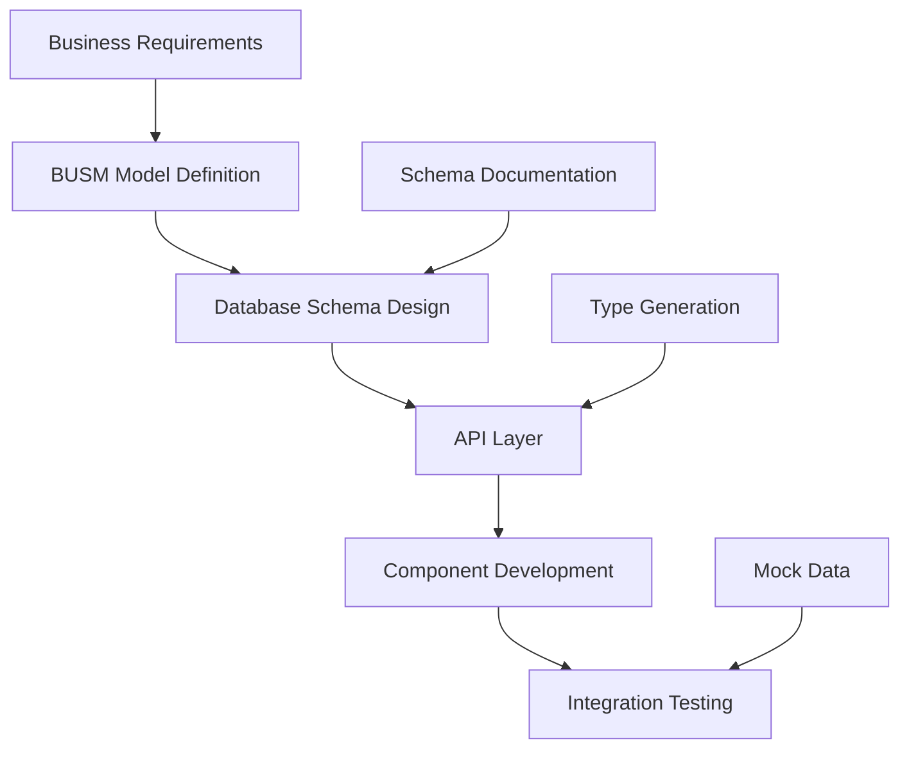

# BUSM-Driven Development Process

## Overview
Business Understanding Semantic Model (BUSM) should drive our entire development process, ensuring alignment between business needs and technical implementation.

## Development Flow



## Process Steps

### 1. Business Understanding Phase
- [ ] Define business entities (Account, Contact, Service Location, etc.)
- [ ] Map relationships between entities
- [ ] Document business rules and constraints
- [ ] Identify data access patterns

### 2. Schema Design Phase
- [ ] Check existing schema: `node scripts/document-schema.js`
- [ ] Design new tables based on BUSM
- [ ] Create migration files
- [ ] Define RLS policies
- [ ] Test in Supabase Dashboard

### 3. Type Generation Phase
- [ ] Generate TypeScript types from schema
- [ ] Create shared type definitions
- [ ] Ensure client/server type alignment

### 4. API Development Phase
- [ ] Create server-side API routes
- [ ] Use service role key for full access
- [ ] Implement proper error handling
- [ ] Add request validation

### 5. Component Development Phase
- [ ] Build components using established types
- [ ] Use hooks for data fetching
- [ ] Implement loading and error states
- [ ] Follow existing UI patterns

### 6. Integration Testing Phase
- [ ] Test with real database
- [ ] Verify data flow end-to-end
- [ ] Check error scenarios
- [ ] Performance testing

## Key Principles

### 1. Schema First
**Always** check and document the database schema before building components:
```bash
# Document current schema
node scripts/document-schema.js

# Check specific table
npm run supabase-health-check
```

### 2. Type Safety
Use TypeScript types generated from the database:
```typescript
// Good - using database types
import type { Database } from '@/lib/supabase/database.types'
type Account = Database['public']['Tables']['accounts']['Row']

// Bad - creating ad-hoc types
interface Account {
  company_name: string // Might not match DB!
}
```

### 3. Server-Side Data Access
For security and RLS bypass, use API routes:
```typescript
// Good - API route with service role
export async function GET() {
  const supabase = createClient(url, serviceRoleKey)
  // Full access to data
}

// Risky - client-side with anon key
const supabase = createClient(url, anonKey)
// Limited by RLS policies
```

### 4. Consistent Naming
Follow database naming conventions:
- Tables: plural, snake_case (`accounts`, `service_locations`)
- Columns: snake_case (`account_name`, `is_primary`)
- Foreign keys: `<table>_id` pattern (`account_id`, `contact_id`)

## Common Patterns

### Fetching Related Data
```sql
-- Get account with contacts
SELECT 
  a.*,
  json_agg(c.*) as contacts
FROM accounts a
LEFT JOIN contacts c ON c.account_id = a.account_number
GROUP BY a.id
```

### Creating Entities with Relations
```typescript
// Create account with initial contact
const { data: account } = await supabase
  .from('accounts')
  .insert({ ... })
  .select()
  .single()

const { data: contact } = await supabase
  .from('contacts')
  .insert({ 
    account_id: account.account_number,
    ...
  })
```

## Debugging Checklist

When things don't work:

1. **Check the schema exists**
   - Run health check: `node scripts/supabase-health-check.js`
   - View in Supabase Dashboard

2. **Verify column names**
   - Document schema: `node scripts/document-schema.js`
   - Check for typos (company_name vs account_name)

3. **Test authentication**
   - Client-side: Uses anon key, limited by RLS
   - Server-side: Uses service role, full access

4. **Check relationships**
   - Foreign key constraints
   - Data types match (UUID vs VARCHAR)

5. **Review API response**
   - Console.log the actual data structure
   - Verify transformation logic

## Migration Strategy

### From Mock to Real Data
1. Keep mock data as fallback
2. Implement real data fetching
3. Test thoroughly
4. Remove mock data

### Schema Changes
1. Create migration file
2. Test in development
3. Run migration
4. Update types
5. Update components

## Tools and Scripts

- `scripts/document-schema.js` - Document current schema
- `scripts/supabase-health-check.js` - Test connection
- `src/app/test/supabase-debug` - Debug page
- `src/app/test/server-test` - Server-side test
- `supabase/migrations/` - SQL migrations

## Success Metrics

- [ ] Zero runtime type errors
- [ ] All data fetching through API routes
- [ ] Schema documented and up-to-date
- [ ] Components match business model
- [ ] No hardcoded mock data in production