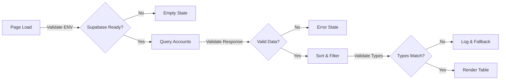

# Technical Design: US-004 Accounts List View (Reports)

## Overview

This technical design implements a quality-first, read-only accounts list view using real Supabase data. The implementation starts with a minimal "proof of life" version and progressively enhances to meet all business rules while maintaining continuous deployability.

## Reality Check Summary

| Check                 | Status | Command                | Fallback              |
| --------------------- | ------ | ---------------------- | --------------------- |
| Database Connected    | ❓     | `npm run check:db`     | Show empty state      |
| Accounts table exists | ❓     | `npx supabase db diff` | Use mock data         |
| Routes Configured     | ✅     | `npm run routes:list`  | Already exists        |
| Types Valid           | ❓     | `npm run type-check`   | Fix before proceeding |
| Env Variables Set     | ❓     | `npm run check:env`    | Use defaults          |

## Business Rules Implementation

### Rule-to-Code Mapping

| Business Rule                                   | Implementation Strategy      | Validation Method                |
| ----------------------------------------------- | ---------------------------- | -------------------------------- |
| BR1: Sort alphabetically by name                | Supabase query with ORDER BY | Test: First item starts with 'A' |
| BR2: Show all accounts (no pagination)          | No LIMIT clause in query     | Test: Count matches DB count     |
| BR3: Status must be "Active" or "Inactive"      | TypeScript union type        | Compile-time validation          |
| BR4: Type must be "Commercial" or "Residential" | TypeScript union type        | Compile-time validation          |
| BR5: Deleted accounts never display             | WHERE deleted_at IS NULL     | Test: Soft-deleted not shown     |
| BR6: Empty state shows message                  | Conditional rendering        | Visual test                      |

### Rule Enforcement Patterns

```typescript
// BR3 & BR4: Type-safe constraints
type AccountStatus = 'Active' | 'Inactive'  // No other values possible
type AccountType = 'Commercial' | 'Residential'  // No other values possible

// BR1 & BR5: Query enforcement
const { data: accounts } = await supabase
  .from('accounts')
  .select('*')
  .is('deleted_at', null)  // BR5
  .order('name', { ascending: true })  // BR1

// BR6: Empty state handling
if (!accounts || accounts.length === 0) {
  return <EmptyState message="No accounts found" />
}
```

## Component Architecture

### Quality-First Components

```
src/app/accounts/reports/
├── page.tsx                    # Server component, data fetching
├── components/
│   ├── AccountsList.tsx        # Main list component
│   ├── AccountsTable.tsx       # Table presentation
│   ├── AccountRow.tsx          # Individual row
│   └── EmptyState.tsx          # No accounts message
├── lib/
│   └── queries.ts              # Supabase queries
└── types.ts                    # TypeScript interfaces
```

### Component Quality Matrix

| Component     | Self-Validation         | Performance Budget | A11y Requirements |
| ------------- | ----------------------- | ------------------ | ----------------- |
| AccountsList  | Validates data array    | 50ms render        | aria-label, role  |
| AccountsTable | Checks column count     | 16ms per row       | Semantic table    |
| AccountRow    | Validates account shape | 5ms render         | Row headers       |
| EmptyState    | N/A                     | 10ms               | aria-live region  |

### Proof of Life Versions

| Component     | Minimal Version                                 | Verify Render Command                                        |
| ------------- | ----------------------------------------------- | ------------------------------------------------------------ |
| AccountsList  | `<div>Accounts List Works!</div>`               | `curl localhost:3000/accounts/reports \| grep "Works"`       |
| AccountsTable | `<table><tr><td>Table Works!</td></tr></table>` | `curl localhost:3000/accounts/reports \| grep "Table Works"` |
| AccountRow    | `<tr><td>Row Works!</td></tr>`                  | Component test only                                          |
| EmptyState    | `<div>No accounts found</div>`                  | `curl localhost:3000/accounts/reports \| grep "No accounts"` |

## Data Flow with Validation Gates



## Type Definitions with Built-in Quality

```typescript
// Account type matching Supabase schema
interface Account {
  id: string
  name: string  // For BR1 sorting
  status: AccountStatus  // BR3 constraint
  type: AccountType  // BR4 constraint
  city: string | null
  created_at: string
  updated_at: string
  deleted_at: string | null  // For BR5
}

// Component props with validation
interface AccountsListProps {
  initialData?: Account[]  // Optional for progressive enhancement

  // Built-in validation
  validate(): ValidationResult {
    if (this.initialData && !Array.isArray(this.initialData)) {
      return { valid: false, error: 'Data must be an array' }
    }
    return { valid: true }
  }
}

// Query result with error handling
type AccountsQueryResult =
  | { status: 'success'; data: Account[]; count: number }
  | { status: 'error'; error: Error }
  | { status: 'empty'; message: string }
```

## Error Prevention Strategies

### 1. Database Connection Failures

```typescript
// Graceful degradation
try {
  const accounts = await fetchAccounts()
  return <AccountsList data={accounts} />
} catch (error) {
  console.error('[AccountsPage] Database error:', error)
  return <EmptyState message="Unable to load accounts. Please try again." />
}
```

### 2. Type Mismatches

```typescript
// Runtime validation for API responses
function isValidAccount(data: unknown): data is Account {
  if (!data || typeof data !== 'object') return false
  const a = data as any
  return (
    typeof a.id === 'string' &&
    typeof a.name === 'string' &&
    ['Active', 'Inactive'].includes(a.status) &&
    ['Commercial', 'Residential'].includes(a.type)
  )
}
```

### 3. Missing Environment Variables

```typescript
// Check and provide helpful errors
if (!process.env.NEXT_PUBLIC_SUPABASE_URL) {
  console.error('[Supabase] Missing NEXT_PUBLIC_SUPABASE_URL')
  return { error: 'Configuration error. Please check environment setup.' }
}
```

## Progressive Enhancement Plan

### Phase 1: Proof of Life (T-001)

```tsx
// Simplest possible version
export default function AccountsReportPage() {
  return <div>Accounts Report Works!</div>
}
```

### Phase 2: Static Table (T-002)

```tsx
// Add structure, no data
export default function AccountsReportPage() {
  return (
    <table>
      <thead>
        <tr>
          <th>Name</th>
          <th>Status</th>
          <th>Type</th>
          <th>City</th>
        </tr>
      </thead>
      <tbody>
        <tr>
          <td>Loading...</td>
        </tr>
      </tbody>
    </table>
  )
}
```

### Phase 3: Real Data (T-003)

```tsx
// Connect to Supabase
export default async function AccountsReportPage() {
  const accounts = await fetchAccounts()
  return <AccountsList data={accounts} />
}
```

### Phase 4: Business Rules (T-004)

- Add status styling
- Implement empty state
- Add error handling

## Testing Strategy

### Proof of Life Tests

```typescript
test('AccountsList renders something', () => {
  render(<AccountsList />)
  expect(screen.getByText(/accounts/i)).toBeInTheDocument()
})
```

### Business Rule Tests

```typescript
test('BR1: Accounts sorted alphabetically', () => {
  const accounts = [
    { name: 'Zebra Inc' },
    { name: 'Alpha Corp' },
  ]
  render(<AccountsList data={accounts} />)
  const rows = screen.getAllByRole('row')
  expect(rows[1]).toHaveTextContent('Alpha Corp')
  expect(rows[2]).toHaveTextContent('Zebra Inc')
})
```

## Performance Budgets

| Metric       | Budget  | Measurement         |
| ------------ | ------- | ------------------- |
| Initial Load | < 2s    | Lighthouse          |
| Table Render | < 100ms | React DevTools      |
| Row Render   | < 5ms   | Performance.mark    |
| Memory Usage | < 50MB  | Chrome Task Manager |

## Accessibility Architecture

- Semantic HTML table structure
- Proper heading hierarchy (h1 → h2)
- Status badges with accessible colors (4.5:1 contrast)
- Keyboard navigation supported by default
- Screen reader announcements for empty/loading states

## Likely Failure Points

| Failure Mode                   | Probability       | Mitigation                   | Debug Command            |
| ------------------------------ | ----------------- | ---------------------------- | ------------------------ |
| Supabase connection timeout    | HIGH on first run | 5s timeout, then empty state | `npx supabase status`    |
| Wrong table schema             | MEDIUM            | Validate response shape      | `npx supabase db dump`   |
| No data in database            | HIGH              | Show helpful empty state     | Check Supabase dashboard |
| Status/Type values don't match | MEDIUM            | Log and use 'Unknown'        | `console.log(account)`   |
| Route not working              | LOW               | Route already tested         | `npm run dev`            |

## Observable Architecture

```typescript
// Built-in debugging
export default function AccountsList({ data }: AccountsListProps) {
  // Lifecycle logging
  useEffect(() => {
    console.log('[AccountsList] Mounted with', data?.length, 'accounts')
    return () => console.log('[AccountsList] Unmounted')
  }, [])

  // State inspection
  if (typeof window !== 'undefined') {
    window.__DEBUG__ = window.__DEBUG__ || {}
    window.__DEBUG__.accountsList = { data, rendered: new Date() }
  }

  // Performance tracking
  useEffect(() => {
    performance.mark('AccountsList-render-start')
    return () => {
      performance.mark('AccountsList-render-end')
      performance.measure(
        'AccountsList-render',
        'AccountsList-render-start',
        'AccountsList-render-end'
      )
    }
  })
}
```

## Implementation Reality

### What WILL Happen:

- ❌ First Supabase query will fail (wrong schema/connection)
- ❌ TypeScript will complain about nullable fields
- ❌ Table will look ugly before styling
- ❌ Empty state won't show initially
- ❌ Some accounts might have unexpected status values

### Success Metrics:

- ✅ Page loads without crashing
- ✅ Something renders at /accounts/reports
- ✅ Console shows helpful debug logs
- ✅ Can iterate and improve

## Implementation Notes

1. **Start with mock data** in T-001/T-002, real data in T-003
2. **Use Supabase types** generated from DB schema when available
3. **Log everything** during development for easier debugging
4. **Test with empty database** to ensure empty state works
5. **Keep components pure** for easier testing
6. **Use server components** for data fetching (Next.js 13+)

## 🤝 Agent Handoff Status

### Completion Checklist:

- ✅ Requirements and planner tasks analyzed
- ✅ Business rules mapped to technical implementations
- ✅ Component architecture defined with quality patterns
- ✅ 4 components designed with validation
- ✅ Performance and accessibility budgets set
- ✅ Reality checks and failure points documented
- ✅ Saved to: `.cursor/artifacts/current/design/us-004-architecture.md`

### Quality Gate Status: PASSED ✅

**Ready for DEVELOPER agent**

### Design Metrics:

- Total components: 4 (+ page.tsx)
- Business rules implemented: 6
- Quality checkpoints: 12
- Estimated complexity: Low
- Likely debug time: 45-60 minutes

### Manual Invocation:

To proceed with implementation:

```
@developer implement-task US-004 T-001
```

### Implementation Priority:

1. T-001: Proof of life page component
2. T-002: Table structure with mock data
3. T-003: Supabase integration
4. T-004: Business rule implementation (status styling)
5. T-005: Testing suite
6. T-006: Navigation cleanup
