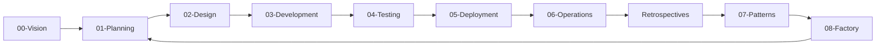

# SDLC Experimental - Phase-Based Software Factory

## 🎯 Purpose

This is our experimental sandbox for building and testing the Software Factory using a proper SDLC phase structure. Every artifact has a home, every phase has processors, and our US-006 journey has a clear path.

## 📁 Structure Overview

```
00-vision/           → Strategic vision and methodology
01-planning/         → Requirements, features, user stories
02-design/           → Technical designs, diagrams, specs
03-development/      → Generated code (components, APIs, types)
04-testing/          → Test plans, cases, and automation
05-deployment/       → Deployment configurations
06-operations/       → Retrospectives, metrics, incidents
07-patterns/         → Reusable templates (UI, API, test)
08-factory/          → The factory itself (agents, processors)
09-archive/          → Historical artifacts and experiments
```

## 🔄 The SDLC Flow



## 📂 Detailed Structure

### 00-vision/

**Purpose**: Strategic direction and methodology

- `software-factory-vision.md` - Our north star
- `sdlc-methodology.md` - How we work

### 01-planning/

**Purpose**: Transform business needs into user stories

- `features/` - Feature documents (like Master View)
- `user-stories/` - Stories generated from features
- `processors/` - Feature→Story generators

### 02-design/

**Purpose**: Technical specifications and architecture

- `as-builts/` - Documentation of what we actually built
- `diagrams/` - Architecture and flow diagrams
- `specs/` - Technical specifications
- `processors/` - Design document generators

### 03-development/

**Purpose**: Code generation and implementation

- `components/` - Generated React components
- `apis/` - Generated API routes
- `types/` - Generated TypeScript types
- `processors/` - Code generators (BUSM→Code)

### 04-testing/

**Purpose**: Quality assurance and validation

- `test-plans/` - Testing strategies
- `test-cases/` - Generated test cases
- `processors/` - Test generators

### 05-deployment/

**Purpose**: Ship to production

- `configs/` - Deployment configurations
- `processors/` - Deployment automation

### 06-operations/

**Purpose**: Learn from running system

- `retrospectives/` - What we learned
- `metrics/` - Performance data
- `incidents/` - Issues and resolutions

### 07-patterns/

**Purpose**: Reusable templates library

- `ui-patterns/` - Master-Detail-Detail, modals, etc.
- `api-patterns/` - CRUD, pagination, auth, etc.
- `test-patterns/` - Common test scenarios

### 08-factory/

**Purpose**: The machinery that builds software

- `agents/` - Intelligent agents (story-builder, etc.)
- `processors/` - Simple, deterministic processors
- `pipelines/` - Chains of processors

### 09-archive/

**Purpose**: Historical record and learning

- `experiments/` - Failed experiments (valuable learning!)
- Old versions of documents

## 🚀 US-006 Journey Path

Our methodical journey through US-006 follows this path:

1. **Planning** (01): Review feature doc → Generate story
2. **Design** (02): Create technical spec → Document decisions
3. **Development** (03): Generate code → Build components
4. **Testing** (04): Generate tests → Validate
5. **Deployment** (05): Configure → Ship
6. **Operations** (06): Monitor → Retrospect
7. **Patterns** (07): Extract reusable patterns
8. **Factory** (08): Build processors from patterns

## 🎯 Current Focus

**US-006: Service Locations Column**

- Location: `01-planning/user-stories/US-006-service-locations.md`
- Feature: `01-planning/features/master-view-feature-v2.md`
- Next: Analyze story-builder agent in `08-factory/agents/`

## 📝 Artifact Placement Guide

| Artifact Type     | Location                      | Example                      |
| ----------------- | ----------------------------- | ---------------------------- |
| Feature Document  | 01-planning/features/         | master-view-feature.md       |
| User Story        | 01-planning/user-stories/     | US-006-service-locations.md  |
| Technical Spec    | 02-design/specs/              | service-location-api.md      |
| As-Built Diagram  | 02-design/as-builts/          | master-view-architecture.md  |
| Component Code    | 03-development/components/    | ServiceLocationCard.tsx      |
| API Route         | 03-development/apis/          | service-locations-route.ts   |
| Test Plan         | 04-testing/test-plans/        | master-view-test-strategy.md |
| Deployment Config | 05-deployment/configs/        | vercel.json                  |
| Retrospective     | 06-operations/retrospectives/ | US-006-learnings.md          |
| UI Pattern        | 07-patterns/ui-patterns/      | three-column-layout.md       |
| Processor         | 08-factory/processors/        | feature-to-story.js          |

## 🔧 How to Use This Structure

1. **Start with Vision** (00): Understand the why
2. **Plan in Planning** (01): Define what to build
3. **Design in Design** (02): Specify how to build
4. **Develop in Development** (03): Generate the code
5. **Test in Testing** (04): Validate it works
6. **Deploy via Deployment** (05): Ship it
7. **Learn in Operations** (06): Gather feedback
8. **Extract to Patterns** (07): Identify reusable parts
9. **Automate in Factory** (08): Build processors

## ✅ Benefits of This Structure

- **Clear Artifact Homes**: Never wonder where something goes
- **Phase Alignment**: Follows standard SDLC phases
- **Processor Co-location**: Generators live with their outputs
- **Pattern Extraction**: Clear path from specific to reusable
- **Factory Separation**: Tools separate from content
- **Learning Loop**: Operations feeds back to planning

---

_This structure is our foundation for building the Software Factory methodically and systematically._
