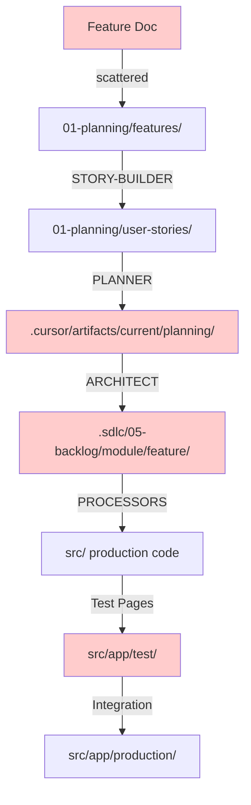

# 🚨 ARTIFACT STORAGE ANALYSIS - Current State of Chaos

**Date**: August 17, 2025  
**Status**: CRITICAL - Files scattered across multiple locations  
**Recommendation**: Major restructuring needed before continuing development

---

## 📍 Current Storage Locations (The Mess)

Our pipeline artifacts are currently scattered across **AT LEAST 15 different locations**:

### 1. `.cursor/` Directory Structure

```
.cursor/artifacts/current/
├── planning/          # PLANNER outputs (US-XXX-tasks.md)
├── development/       # DEVELOPER completion markers
├── testing/          # TESTER reports
└── session-state.json # Session tracking
```

**Used by**: PLANNER v5.2, DEVELOPER v4.3, TESTER v3.0

### 2. `.sdlc/` Root Locations

```
.sdlc/
├── 01-planning/
│   ├── features/      # Feature documents (INPUT)
│   └── user-stories/  # STORY-BUILDER outputs
├── 02-design/
│   └── specs/        # ARCHITECT outputs (US-XXX-architecture.md)
├── 05-backlog/
│   └── [module]/[feature]/  # Processor manifests, some architecture
├── handoffs/         # Task completion handoffs
└── current-work/     # Value slices tracking
```

### 3. `.product-specs/` Directory (Legacy?)

```
.product-specs/00-platform-core/epics/*/features/*/stories/
```

**Used by**: Some agent prompts still reference this (needs updating)

### 4. `src/` Production Code

```
src/
├── components/       # Generated components
├── hooks/           # Generated hooks
├── types/           # Generated types
├── app/
│   └── test/       # Test pages (US-XXX-slice-X)
└── lib/            # Business logic
```

**Used by**: All processors output here

### 5. `.sdlc/12-sdlc-design/sdlc-experimental/`

```
Duplicate pipeline work, including:
├── 01-planning/user-stories/
├── 02-design/specs/
├── 05-backlog/work-orders/
└── 08-factory/pipelines/
```

**Status**: Experimental duplicate structure (needs consolidation)

### 6. `.sdlc/10-project-tracking/`

```
├── config/session-state.json  # Another session state!
├── iterations/current/
└── reports/validation/
```

**Confusion**: Duplicate session tracking

### 7. `.sdlc/07-operations/`

```
├── daily-sessions/
├── retrospectives/
└── validation-strategy/
```

### 8. `.sdlc/09-retrospectives/`

**Duplicate of 07-operations/retrospectives!**

### 9. `.sdlc/validation/`

```
├── reports/
├── processor-runs/
└── scripts/
```

### 10. Test Artifacts in `src/app/test/`

```
src/app/test/
├── us-xxx-slice-1/
├── us-xxx-slice-2/
└── us-xxx-integrated/
```

**Issue**: Mixed with production code

---

## 🔴 Critical Problems

### 1. **Multiple Session States**

- `.cursor/artifacts/current/session-state.json`
- `.sdlc/10-project-tracking/config/session-state.json`
- Which one is authoritative?

### 2. **Duplicate Structures**

- `.sdlc/01-planning/` vs `.sdlc/12-sdlc-design/sdlc-experimental/01-planning/`
- `.sdlc/07-operations/retrospectives/` vs `.sdlc/09-retrospectives/`
- Multiple backlog locations

### 3. **Path Hardcoding in Agents**

Agents have hardcoded paths that differ:

- STORY-BUILDER: `01-planning/user-stories/`
- PLANNER: `.cursor/artifacts/current/planning/`
- ARCHITECT: `.sdlc/05-backlog/[module]/[feature]/`
- Some still reference `.product-specs/`

### 4. **No Clear Lifecycle**

Files don't move through a clear lifecycle:

- Where do "active" vs "completed" artifacts go?
- When do test pages get cleaned up?
- How do we archive completed work?

### 5. **Mixed Concerns**

- Test code mixed with production (`src/app/test/`)
- Pipeline artifacts mixed with documentation
- Operational logs mixed with design documents

---

## 📊 Artifact Flow Analysis

### Current Pipeline Flow (Scattered)



### By Agent Output Locations

| Agent              | Version | Current Output Location                                       | Issues                 |
| ------------------ | ------- | ------------------------------------------------------------- | ---------------------- |
| STORY-BUILDER      | v2.1    | `01-planning/user-stories/`                                   | OK                     |
| PLANNER            | v5.2    | `.cursor/artifacts/current/planning/`                         | Hidden directory       |
| ARCHITECT          | v5.0    | `.sdlc/05-backlog/[module]/[feature]/`                        | Complex path           |
| PROCESSOR-SELECTOR | v2.0    | `.sdlc/05-backlog/[module]/[feature]/processor-manifest.json` | Same as architect      |
| TYPE-PROCESSOR     | v1.0    | `src/types/`                                                  | Mixed with manual code |
| SCAFFOLD-PROCESSOR | v1.0    | `src/components/`                                             | Mixed with manual code |
| REACT-PROCESSOR    | v1.0    | `src/components/`                                             | Modifies existing      |
| HOOK-PROCESSOR     | v1.0    | `src/hooks/`                                                  | Mixed with manual code |
| DEVELOPER          | v4.3    | Various `src/` locations                                      | No tracking            |
| TESTER             | v3.0    | `.cursor/artifacts/current/testing/`                          | Hidden directory       |
| DEVOPS             | v6.0    | No specific output location                                   | Orchestration only     |

---

## 🎯 Immediate Problems This Causes

1. **Can't find artifacts**: "Where did PLANNER put the tasks?"
2. **Version confusion**: "Which user story is current?"
3. **Cleanup issues**: "What can be deleted?"
4. **Onboarding nightmare**: New team members lost
5. **Automation blocked**: Scripts can't find consistent paths
6. **Git pollution**: Committing temporary artifacts
7. **No audit trail**: Can't trace feature to code

---

## 💡 Recommendations for Discussion

### Option 1: Centralized Pipeline Directory

```
.pipeline/
├── active/           # Current work
│   ├── features/
│   ├── stories/
│   ├── tasks/
│   ├── architecture/
│   └── manifests/
├── staging/          # Test artifacts
│   └── test-pages/
├── completed/        # Archived work
└── session.json      # Single session state
```

### Option 2: Lifecycle-Based Structure

```
.sdlc/
├── 01-inbox/         # New features
├── 02-active/        # Work in progress
├── 03-staging/       # Testing
├── 04-production/    # Ready for deploy
└── 05-archive/       # Completed work
```

### Option 3: Feature-Centric Folders

```
.features/
└── US-006/
    ├── story.md
    ├── tasks.md
    ├── architecture.md
    ├── manifest.json
    ├── test-artifacts/
    └── status.json
```

---

## 🚨 Urgent Actions Needed

1. **STOP adding new locations** - No more scattered artifacts
2. **Document current state** - This analysis (✅ DONE)
3. **Choose new structure** - Need team decision
4. **Update all agents** - Consistent path configuration
5. **Migration script** - Move existing artifacts
6. **Update pipeline docs** - Reflect new structure

---

## 📝 Questions for Discussion

1. Should pipeline artifacts be in Git? (Currently mixed)
2. Should we use `.cursor/` at all? (Hidden directory issues)
3. How do we handle test artifacts? (Currently in src/)
4. Single source of truth for session state?
5. How to handle the experimental duplicate structure?
6. Archive strategy for completed work?
7. Should each feature get its own folder?

---

## 🔥 Risk Assessment

**Current Risk Level**: HIGH

- **Development blocked**: Can't reliably find artifacts
- **Data loss risk**: Unclear what's temporary vs permanent
- **Automation impossible**: Inconsistent paths
- **Team confusion**: Everyone putting files in different places
- **Technical debt**: Growing exponentially

**Recommendation**: PAUSE feature development until structure is fixed

---

_This analysis reveals a critical need for immediate restructuring before continuing pipeline development._
