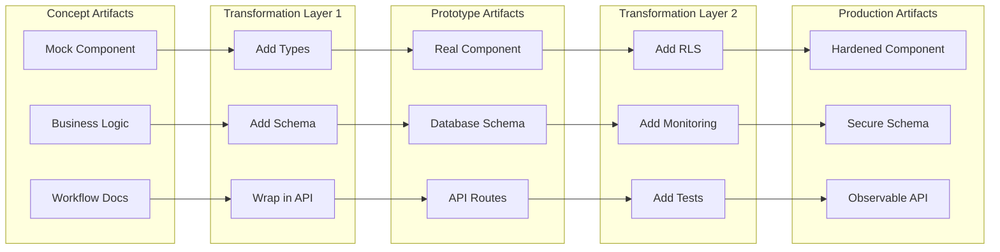
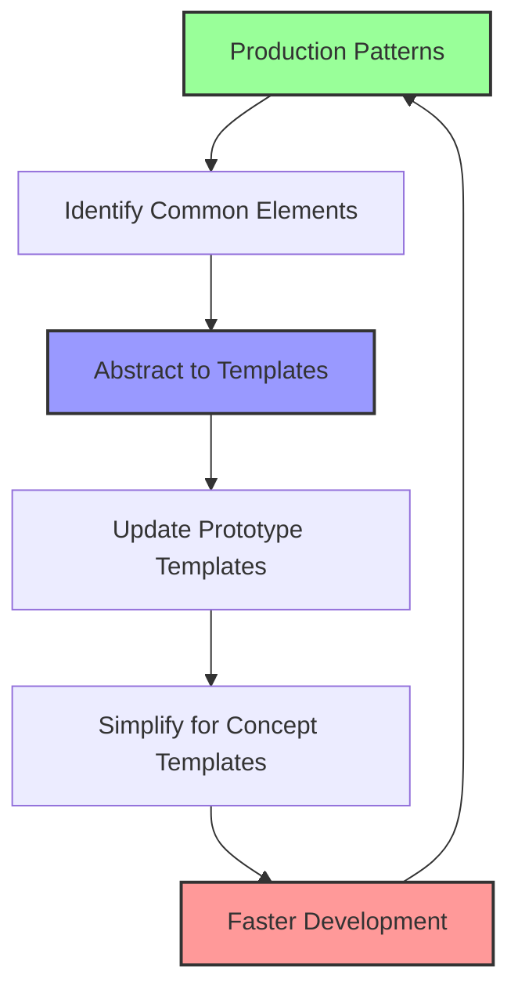

# Progressive Standards Enforcement in the Three-Line Factory

## 🎯 Core Principle: Standards as Progressive Layers

Just as features evolve through lines, standards are applied in layers - each line adds more stringent requirements while preserving the work from previous stages.

---

## 📊 Standards Progression Matrix

| Standard Category   | 🎨 Concept Line | 🔧 Prototype Line | 🏭 Production Line         |
| ------------------- | --------------- | ----------------- | -------------------------- |
| **TypeScript**      | Basic types     | Strict mode       | Full safety flags          |
| **Testing**         | Smoke tests     | 60% coverage      | 80%+ coverage              |
| **Security**        | None            | Basic auth        | Full OWASP + RLS           |
| **API Design**      | Mock endpoints  | REST basics       | Full REST + rate limiting  |
| **Components**      | Functional only | + Accessibility   | + Performance optimization |
| **Documentation**   | Business logic  | + API docs        | + Full TSDoc               |
| **Monitoring**      | Console logs    | Error tracking    | Full observability         |
| **Data Validation** | UI only         | + Zod schemas     | + Domain rules             |

---

## 🔄 Implementation: Standards as Code

### Factory Configuration with Progressive Standards

```yaml
# factory-standards.yaml
standards:
  concept:
    typescript:
      strict: false
      noImplicitAny: true
      skipLibCheck: true

    testing:
      required: false
      smokeTestsOnly: true

    components:
      patterns: ['functional']
      stateManagement: ['useState']
      styling: ['inline', 'tailwind-classes']

    validation:
      level: 'ui-only'
      library: 'html5'

  prototype:
    extends: concept
    typescript:
      strict: true
      noUnusedLocals: true

    testing:
      required: true
      coverage:
        statements: 60
        branches: 50
        functions: 60

    security:
      authentication: required
      authorization: basic-roles
      rls: single-tenant

    api:
      pattern: rest
      validation: zod
      errors: basic-http-codes

    components:
      patterns: ['container', 'presentational']
      accessibility: ['aria-labels', 'keyboard-nav']

  production:
    extends: prototype
    typescript:
      strict: true
      noImplicitReturns: true
      exactOptionalPropertyTypes: true
      noUncheckedIndexedAccess: true

    testing:
      coverage:
        statements: 80
        branches: 75
        functions: 80
        critical_paths: 95

    security:
      owasp_top_10: enforced
      rls: multi-tenant
      encryption: ['at-rest', 'in-transit']
      mfa: available

    api:
      rate_limiting:
        auth: '5/min'
        standard: '100/min'
      versioning: required
      monitoring: full

    performance:
      lighthouse: 90
      fcp: '<1.5s'
      cls: '<0.1'
```

---

## 🤖 Line-Aware Agents and Processors

### Single Agent Set with Progressive Behavior

Each agent adapts its behavior based on the target line, progressively adding sophistication:

```yaml
# agent-line-config.yaml
agents:
  STORY-BUILDER:
    version: 3.0
    line_behaviors:
      concept:
        focus: 'Business workflow and UX validation'
        skip: ['Technical specs', 'API contracts', 'Database design']
        output: 'Simplified stories with mock data requirements'

      prototype:
        focus: 'Technical feasibility and integration'
        include: ['Basic API contracts', 'Simple schemas']
        output: 'Technical stories with single-tenant scope'

      production:
        focus: 'Complete implementation with all edge cases'
        include: ['Full technical specs', 'Security requirements', 'Performance targets']
        output: 'Production-ready stories with multi-tenant considerations'

  ARCHITECT:
    version: 5.0
    line_behaviors:
      concept:
        skip: true # No architecture needed for mocks

      prototype:
        focus: 'Basic component structure'
        include: ['Component hierarchy', 'Simple state management']
        skip: ['Performance optimization', 'Caching strategies']

      production:
        focus: 'Enterprise architecture'
        include: ['Scalability patterns', 'Caching layers', 'Error boundaries']
        output: 'Complete technical architecture'
```

### Progressive Processor Chain

Processors operate in modes that align with line standards:

```yaml
# processor-line-config.yaml
processors:
  TYPE-PROCESSOR:
    version: 2.0
    modes:
      concept:
        command: 'type-processor --mode=concept'
        allows_any: true
        validation: none
        output: 'basic.types.ts'

      prototype:
        command: 'type-processor --mode=prototype --input=basic.types.ts'
        allows_any: false
        validation: 'typescript'
        output: ['strict.types.ts', 'validation.ts']

      production:
        command: 'type-processor --mode=production --input=strict.types.ts'
        validation: 'zod'
        includes: ['branded-types', 'runtime-guards']
        output: ['branded.types.ts', 'schemas.ts', 'guards.ts']

  SCAFFOLD-PROCESSOR:
    version: 2.0
    modes:
      concept:
        template: 'mock-component'
        includes: ['local-state', 'mock-data']

      prototype:
        template: 'basic-component'
        includes: ['props', 'error-handling', 'loading-states']

      production:
        template: 'enterprise-component'
        includes: ['error-boundaries', 'performance-monitoring', 'accessibility']
```

---

## 🏗️ Build Inheritance System

### How Each Line Builds on Previous Work

```typescript
// Line Progression Interfaces
interface ConceptOutput {
  mockComponent: string
  businessLogic: BusinessRules
  mockData: MockDataGenerator
  workflow: WorkflowDocument
}

interface PrototypeOutput extends ConceptOutput {
  realComponent: string
  schema: string
  types: string
  api: string
  migrations: string[]
}

interface ProductionOutput extends PrototypeOutput {
  monitoring: string
  tests: string[]
  performance: OptimizationConfig
  security: SecurityConfig
}
```

### The Transformation Pipeline



---

## 🔧 Practical Examples

### Example: SERVICE_LOCATION Modal Evolution

#### Concept Line Output

```typescript
// ✅ Passes Concept Standards
// ❌ Would fail Prototype Standards (no types, no error handling)

const MockServiceLocationModal = ({ onSave }) => {
  const [location, setLocation] = useState({
    name: '',
    address: ''
  });

  const handleSubmit = (e) => {
    e.preventDefault();
    onSave(location);
    toast('Location saved!');
  };

  return (
    <form onSubmit={handleSubmit}>
      <input
        value={location.name}
        onChange={(e) => setLocation({...location, name: e.target.value})}
        required
      />
      <button type="submit">Save</button>
    </form>
  );
};
```

#### Prototype Line Transformation

```typescript
// ✅ Passes Prototype Standards
// ❌ Would fail Production Standards (no monitoring, basic error handling)

// Adds: TypeScript, Zod validation, Error handling, Accessibility
interface ServiceLocationModalProps {
  location?: ServiceLocation;
  onSave: (location: ServiceLocation) => Promise<void>;
  onCancel: () => void;
}

const ServiceLocationModal: React.FC<ServiceLocationModalProps> = ({
  location,
  onSave,
  onCancel
}) => {
  const [formData, setFormData] = useState<ServiceLocationInput>(
    location || defaultLocation
  );
  const [errors, setErrors] = useState<ValidationErrors>({});
  const [saving, setSaving] = useState(false);

  const handleSubmit = async (e: React.FormEvent) => {
    e.preventDefault();

    // Zod validation
    const result = ServiceLocationSchema.safeParse(formData);
    if (!result.success) {
      setErrors(formatZodErrors(result.error));
      return;
    }

    setSaving(true);
    try {
      await onSave(result.data);
      toast.success('Location saved');
      onCancel();
    } catch (error) {
      toast.error('Failed to save location');
    } finally {
      setSaving(false);
    }
  };

  return (
    <form onSubmit={handleSubmit} aria-label="Service Location Form">
      <TextField
        label="Location Name"
        value={formData.name}
        onChange={(value) => setFormData({...formData, name: value})}
        error={errors.name}
        required
        aria-required="true"
      />
      {/* More fields with validation */}
      <Button
        type="submit"
        loading={saving}
        disabled={saving}
        aria-busy={saving}
      >
        Save Location
      </Button>
    </form>
  );
};
```

#### Production Line Enhancement

```typescript
// ✅ Passes ALL Production Standards

const ServiceLocationModal: React.FC<ServiceLocationModalProps> = ({
  location,
  onSave,
  onCancel
}) => {
  // Previous prototype code remains...

  // ADD: Performance monitoring
  useEffect(() => {
    metrics.componentMount('ServiceLocationModal');
    return () => metrics.componentUnmount('ServiceLocationModal');
  }, []);

  // ADD: Error boundary integration
  const handleSubmit = async (e: React.FormEvent) => {
    e.preventDefault();
    const submitTimer = metrics.startTimer('service_location.submit');

    try {
      // Previous validation code...

      // ADD: Optimistic updates with rollback
      const optimisticId = optimisticUpdate(formData);

      await onSave(result.data);

      // ADD: Success tracking
      metrics.increment('service_location.save.success');
      submitTimer.success();

    } catch (error) {
      // ADD: Detailed error tracking
      metrics.increment('service_location.save.error', {
        error_type: error.name,
        error_code: error.code
      });
      submitTimer.failure();

      // ADD: Rollback optimistic update
      rollbackOptimisticUpdate(optimisticId);

      // ADD: User-friendly error messages
      const userMessage = getUserFriendlyError(error);
      toast.error(userMessage);

      // ADD: Error reporting
      Sentry.captureException(error, {
        tags: { component: 'ServiceLocationModal' },
        extra: { formData }
      });
    }
  };

  // ADD: Accessibility announcements
  useAnnouncement(saving ? 'Saving location...' : null);

  return (
    <ErrorBoundary fallback={<ModalErrorFallback />}>
      {/* Previous form code with added telemetry */}
    </ErrorBoundary>
  );
};
```

---

## 🚦 Standards Enforcement Automation

### Pre-commit Hooks by Line

```json
// .husky/pre-commit
{
  "concept": ["npm run lint:concept", "npm run test:smoke"],
  "prototype": [
    "npm run lint:strict",
    "npm run test:coverage -- --min=60",
    "npm run type-check",
    "npm run security:basic"
  ],
  "production": [
    "npm run lint:strict",
    "npm run test:coverage -- --min=80",
    "npm run test:critical-paths -- --min=95",
    "npm run type-check:strict",
    "npm run security:full",
    "npm run performance:check"
  ]
}
```

### Line-Aware Pipeline Execution

```bash
# Execute pipeline with line context
npm run pipeline:concept US-001    # Generates mocks only
npm run pipeline:prototype US-001  # Transforms to real components
npm run pipeline:production US-001 # Adds all production features

# Agents automatically adapt
@story-builder create-story feature.md --line=concept
@architect design US-001 --line=prototype  # Simplified architecture
@processor-selector manifest US-001 --line=production
```

### Progressive CI/CD Pipeline

```yaml
# .github/workflows/progressive-pipeline.yml
name: Progressive Standards Pipeline

jobs:
  detect-line:
    runs-on: ubuntu-latest
    outputs:
      line: ${{ steps.detect.outputs.line }}
    steps:
      - id: detect
        run: |
          if [[ "${{ github.ref }}" == *"concept"* ]]; then
            echo "line=concept" >> $GITHUB_OUTPUT
          elif [[ "${{ github.ref }}" == *"prototype"* ]]; then
            echo "line=prototype" >> $GITHUB_OUTPUT
          else
            echo "line=production" >> $GITHUB_OUTPUT
          fi

  validate:
    needs: detect-line
    runs-on: ubuntu-latest
    steps:
      - uses: actions/checkout@v3

      - name: Run Line-Specific Validation
        run: |
          npm run validate:${{ needs.detect-line.outputs.line }}

      - name: Check Standards Compliance
        run: |
          npm run standards:check -- --line=${{ needs.detect-line.outputs.line }}
```

---

## 📋 Standard Progression Checklists

### Concept → Prototype Checklist

```markdown
- [ ] All TypeScript 'any' replaced with proper types
- [ ] Zod schemas created for all data structures
- [ ] Error handling added to all async operations
- [ ] Basic accessibility attributes added
- [ ] Mock data replaced with database queries
- [ ] Authentication checks implemented
- [ ] Basic API routes created
- [ ] 60% test coverage achieved
```

### Prototype → Production Checklist

```markdown
- [ ] Full TypeScript strict mode compliance
- [ ] Multi-tenant RLS policies implemented
- [ ] Comprehensive error boundaries added
- [ ] Performance monitoring instrumented
- [ ] 80% test coverage (95% critical paths)
- [ ] Rate limiting configured
- [ ] WCAG 2.1 AA compliance verified
- [ ] Load testing completed
- [ ] Security scan passed
- [ ] Documentation complete with TSDoc
```

---

## 🔄 Continuous Improvement Loop



### Pattern Evolution Example

1. **Production discovers**: All modals need error boundaries
2. **Template updated**: Prototype modals include basic error handling
3. **Concept simplified**: Concept modals get try-catch wrapper
4. **Result**: Error handling built-in from start

### Agent and Processor Evolution

As patterns emerge, agents and processors evolve to incorporate them:

```yaml
# Example: REACT-PROCESSOR learns from production patterns
processor_evolution:
  v1.0:
    concept: 'Basic component with useState'
    prototype: 'Add props and basic types'
    production: 'Manual error boundaries added'

  v1.1: # After pattern detection
    concept: 'Component with error wrapper'
    prototype: 'Props, types, and try-catch'
    production: 'Full error boundary automatic'

  v2.0: # Further evolution
    concept: 'Includes loading states'
    prototype: 'Async handling built-in'
    production: 'Complete resilience patterns'
```

---

## 🎯 Key Benefits

1. **No Rework**: Each line enhances rather than replaces
2. **Clear Progress**: Standards violations = wrong line
3. **Fast Feedback**: Fail fast at appropriate standard level
4. **Learning System**: Templates improve over time
5. **Flexible Pace**: Move between lines at feature's own speed

---

_"Standards aren't barriers - they're guardrails that widen as you gain speed. Agents and processors aren't separate per line - they're intelligent enough to apply the right standards at the right time."_
