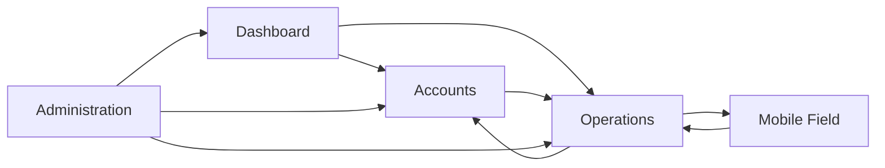

# 1. Refined Module Structure

**Purpose**: Business-aligned modules optimized for service industry efficiency

## Module A: Dashboard (Executive Overview)

**Purpose**: Single-pane-of-glass with drill-down capability

### Core Features

- **Key Metrics Cards**: Revenue (MTD/YTD), Active customers, Completed services, Outstanding invoices
- **Performance Charts**: Service completion trends, technician utilization, customer acquisition
- **Alert Center**: Overdue invoices, missed appointments, equipment issues, low inventory
- **Quick Actions**: Create work order, add customer, view today's schedule
- **Drill-down Tables**: Click any metric to see underlying data in spreadsheet format

### Drill-down Pattern

```typescript
// Dashboard metric with drill-down
<MetricCard
  title="Outstanding Invoices"
  value="$12,450"
  count={23}
  onDrillDown={() => router.push('/accounts?filter=outstanding-invoices&view=spreadsheet')}
/>

// Results in spreadsheet view with filtering pre-applied
```

### Mobile Field Dashboard

- **Today's Route**: Simplified view for technicians
- **Current Job Status**: Active work order details
- **Quick Capture**: Photos, notes, completion status

## Module B: Accounts (Three-Panel Drill-Down Pattern)

**Purpose**: Efficient customer data navigation using parent/child/grandchild hierarchy

### Primary Interface: Three-Panel Layout

```
┌─────────────┬─────────────────┬──────────────────────┐
│ Accounts    │ Child Records   │ Grandchild Details   │
│ (Parent)    │ (Context)       │ (Deep Dive)          │
│             │                 │                      │
│ 🔍 Search   │ Based on        │ Based on child       │
│ [Filter]    │ selected        │ selection:           │
│             │ account:        │                      │
│ • Customer A│                 │                      │
│ ▶ Customer B│ • Locations     │ • Work Orders        │
│ • Customer C│ • Contacts      │ • Communications     │
│ • Customer D│ • Service Items │ • Invoices           │
│             │ • Invoices      │ • Photos             │
│             │ • Contracts     │ • Notes              │
└─────────────┴─────────────────┴──────────────────────┘
```

### Account Panel (Left - 300px)

- **Search/Filter Bar**: Name, status, type, location, balance
- **Account List**: Company name, status indicator, primary contact
- **Quick Stats**: Total customers, active, overdue
- **Bulk Actions**: Export, status updates, mass communication

### Child Records Panel (Middle - 400px)

**Dynamic based on selected account:**

#### When Account Selected → Show Child Types:

- **📍 Locations** (count) - Service addresses
- **👥 Contacts** (count) - People at this account
- **🔧 Service Items** (count) - Equipment/areas serviced
- **💰 Invoices** (count) - Billing records
- **📋 Contracts** (count) - Service agreements
- **📞 Communications** (count) - All interactions

#### When Child Type Selected → Show Records:

- **Location Records**: Address, access notes, items at location
- **Contact Records**: Name, role, phone, email, preferences
- **Service Item Records**: Name, type, last service, status
- **Invoice Records**: Number, amount, status, date
- **Contract Records**: Type, start/end dates, status, value
- **Communication Records**: Date, type, subject, person

### Grandchild Details Panel (Right - Flexible)

**Dynamic based on child record selection:**

#### Location Selected → Show:

- **Work Orders**: All jobs at this location
- **Service Items**: Equipment/areas at this location
- **Access Details**: Keys, codes, special instructions
- **Photos**: Location images, before/after shots

#### Contact Selected → Show:

- **Communication History**: All interactions with this person
- **Work Orders**: Jobs where they were the contact
- **Preferences**: Preferred contact method, times, notes

#### Service Item Selected → Show:

- **Work Order History**: All services performed on this item
- **Service Schedule**: Next due dates, frequencies
- **Photos**: Before/after, progress shots
- **Notes**: Technician observations, recommendations

### Spreadsheet Views

- **Accounts List**: Sortable/filterable table with export capability
- **Service History**: Timeline view with filtering by date/service type
- **Financial Summary**: Invoice aging, payment history, profitability

## Module C: Operations (Three-Panel Work Management)

**Purpose**: Manage all field operations using parent/child/grandchild hierarchy

### Primary Interface: Three-Panel Layout

```
┌─────────────┬─────────────────┬──────────────────────┐
│ Work Orders │ Work Details    │ Deep Dive           │
│ (Parent)    │ (Context)       │ (Execution)         │
│             │                 │                     │
│ 🔍 Search   │ Based on        │ Based on detail     │
│ [Filter]    │ selected WO:    │ selection:          │
│             │                 │                     │
│ • WO-001    │ • Tasks         │ • Photos            │
│ ▶ WO-002    │ • Materials     │ • Time Tracking     │
│ • WO-003    │ • Schedule      │ • Customer Notes    │
│ • WO-004    │ • Technician    │ • Completion Forms  │
│             │ • Location      │ • Follow-ups        │
│             │ • Customer      │ • Billing Details   │
└─────────────┴─────────────────┴──────────────────────┘
```

### Work Orders Panel (Left)

- **Search/Filter**: Status, technician, date, customer, priority
- **Work Order List**: WO number, customer, status, technician, date
- **Quick Stats**: Today's jobs, overdue, completed this week
- **Bulk Actions**: Assign technician, reschedule, status updates

### Work Details Panel (Middle)

**When Work Order Selected → Show Related Records:**

#### Core Work Order Info:

- **📍 Location Details**: Address, access instructions, contact
- **👨‍🔧 Technician Assignment**: Who, when, travel time, equipment needed
- **📋 Service Tasks**: Checklist, completion status, time estimates
- **📦 Materials**: Required inventory, quantities, costs
- **📅 Schedule**: Start time, duration, dependencies, conflicts
- **👤 Customer Info**: Primary contact, special requests, history

#### When Detail Selected → Show Granular Data:

- **Task Details**: Step-by-step procedures, safety notes, time tracking
- **Material Usage**: Quantities used, costs, supplier info
- **Schedule Conflicts**: Overlapping appointments, technician availability
- **Customer Communications**: Recent calls, emails, preferences

### Deep Dive Panel (Right)

**Dynamic based on work detail selection:**

#### Task Selected → Show:

- **Execution Steps**: Detailed procedures, safety requirements
- **Time Tracking**: Start/stop times, actual vs estimated
- **Photos**: Before/during/after documentation
- **Quality Checks**: Completion verification, customer approval

#### Materials Selected → Show:

- **Inventory Status**: Available quantities, locations, costs
- **Usage History**: Previous jobs, consumption patterns
- **Supplier Info**: Reorder points, vendor contacts, delivery times

#### Schedule Selected → Show:

- **Route Optimization**: Drive times, efficient sequencing
- **Technician Calendar**: Availability, skills, equipment
- **Customer Availability**: Preferred times, restrictions

### Alternative Views in Operations:

#### Scheduling View (Calendar Focus):

```
┌─────────────┬─────────────────┬──────────────────────┐
│ Technicians │ Schedule Slots  │ Job Details         │
│             │                 │                     │
│ • John S.   │ 8:00 - WO-001  │ Customer: ABC Corp  │
│ ▶ Sarah M.  │ 10:30 - WO-002 │ Location: Downtown  │
│ • Mike R.   │ 1:00 - WO-003  │ Tasks: Interior     │
│             │ 3:30 - WO-004  │ Materials: Spray    │
│             │ [Available]     │ Duration: 2 hours   │
└─────────────┴─────────────────┴──────────────────────┘
```

#### Route View (Geographic Focus):

```
┌─────────────┬─────────────────┬──────────────────────┐
│ Routes      │ Stops           │ Stop Details        │
│             │                 │                     │
│ • Route A   │ 1. ABC Corp     │ WO-001: Interior    │
│ ▶ Route B   │ 2. DEF Ltd      │ Contact: John Smith │
│ • Route C   │ 3. GHI Inc      │ Access: Front desk  │
│             │ 4. JKL Co       │ Duration: 2 hours   │
│             │ [5.2 hrs total] │ Materials: Standard │
└─────────────┴─────────────────┴──────────────────────┘
```

### Spreadsheet Views

- **Work Order Queue**: All jobs with status, priority, assignment
- **Schedule Grid**: Technician assignments across time periods
- **Performance Reports**: Completion rates, time efficiency, customer ratings

## Module D: Administration (System Maintenance)

**Purpose**: Business configuration and user management

### Sub-modules

#### D1: Business Configuration

- **Domain Settings**: Service types, equipment categories, pricing
- **Workflow Rules**: Approval processes, notification triggers
- **Territory Management**: Service areas, routing zones
- **Integrations**: Third-party systems, data imports/exports

#### D2: User Management

- **User Accounts**: Roles, permissions, access levels
- **Team Structure**: Departments, reporting relationships
- **Security Settings**: Password policies, session management

#### D3: System Data

- **Reference Tables**: Service types, equipment models, suppliers
- **Custom Fields**: Account/work order extensions
- **Templates**: Invoice layouts, service checklists, email templates

#### D4: Reporting & Analytics

- **Standard Reports**: Financial, operational, customer analytics
- **Custom Report Builder**: Drag-and-drop report creation
- **Data Export**: CSV, Excel, PDF formats
- **Audit Logs**: User activity, data changes, system events

## Navigation Structure

```
├── Dashboard
├── Accounts
│   ├── Directory
│   └── [Account Detail]
│       ├── Overview
│       ├── Locations
│       ├── Service Items
│       ├── Contacts
│       ├── Service History
│       ├── Billing
│       └── Communications
├── Operations
│   ├── Work Orders
│   ├── Scheduling
│   ├── Field Mobile
│   └── Technicians
└── Administration
    ├── Business Config
    ├── Users
    ├── System Data
    └── Reports
```

## Cross-Module Data Flow



## Spreadsheet View Philosophy

**Every list becomes a spreadsheet when needed:**

- Standard table view for scanning
- "Spreadsheet Mode" toggle for detailed work
- Export functionality always available
- Bulk operations enabled in spreadsheet mode
- Column customization and sorting
- Inline editing where appropriate
